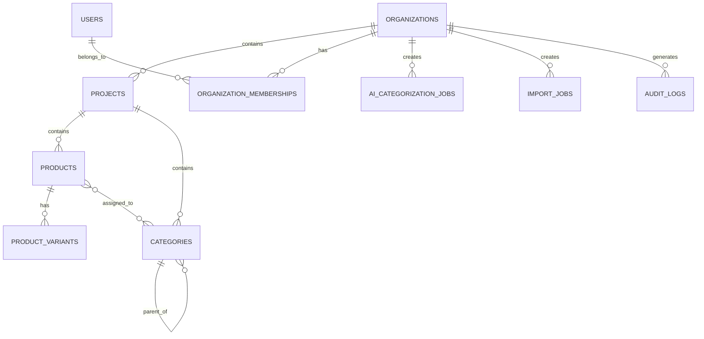
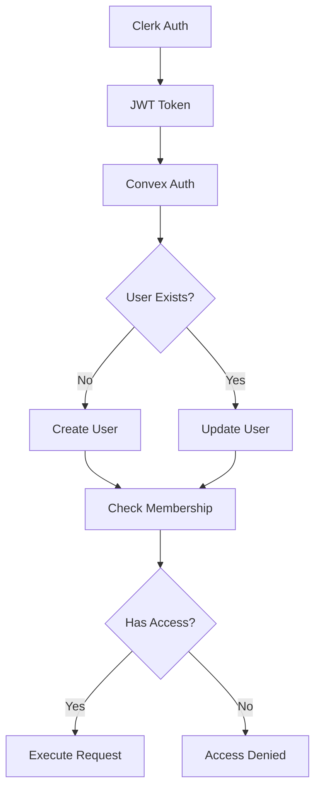

# Convex Database Schema Documentation

This document provides a comprehensive overview of the database schema for the Bulk Grillers Pride application, including table relationships, data models, and design patterns.

## Table of Contents

1. [Overview](#overview)
2. [Core Data Model](#core-data-model)
3. [Entity Relationships](#entity-relationships)
4. [Table Definitions](#table-definitions)
5. [Indexes and Performance](#indexes-and-performance)
6. [Data Patterns](#data-patterns)
7. [Migration Strategy](#migration-strategy)

## Overview

The Bulk Grillers Pride database is designed as a multi-tenant SaaS application with the following key characteristics:

- **Multi-tenancy**: All data is scoped to organizations
- **Hierarchical Categories**: Unlimited depth category trees
- **Audit Trail**: Comprehensive tracking of all changes
- **Real-time**: Optimized for Convex's reactive queries
- **Versioning**: Critical entities support versioning and rollback

### Design Principles

1. **Organization Isolation**: Every table (except `users`) has `organizationId` for data isolation
2. **Soft Deletes**: Use status fields instead of hard deletes
3. **Audit Everything**: Track who, what, when for all changes
4. **Denormalization**: Strategic denormalization for query performance
5. **Type Safety**: Strict schema validation with Convex validators

## Core Data Model

### Multi-Tenant Architecture

```
┌─────────────┐
│Organization │
└──────┬──────┘
       │ 1:N
       ├────────────────┐
       │                │
       ▼                ▼
┌──────────┐     ┌─────────────┐
│ Projects │     │   Members   │
└────┬─────┘     │  (Users +   │
     │           │   Roles)    │
     │           └─────────────┘
     │ 1:N
     ├──────────────┬────────────┐
     ▼              ▼            ▼
┌──────────┐  ┌───────────┐  ┌──────────┐
│ Products │  │Categories │  │  Import  │
└──────────┘  └───────────┘  │   Jobs   │
                              └──────────┘
```

### Key Relationships

1. **Organization → Projects**: One-to-Many
2. **Organization → Users**: Many-to-Many (via organizationMemberships)
3. **Projects → Products**: One-to-Many
4. **Projects → Categories**: One-to-Many (hierarchical)
5. **Products ↔ Categories**: Many-to-Many (via categoryProductAssignments)
6. **Products → Variants**: One-to-Many

## Entity Relationships

### Primary Entity Diagram



### Authentication & Authorization Flow



## Table Definitions

### 1. Organizations Table

**Purpose**: Root tenant entity for multi-tenancy

| Field          | Type    | Description               |
| -------------- | ------- | ------------------------- |
| `_id`          | Id      | Unique identifier         |
| `name`         | string  | Organization display name |
| `slug`         | string  | URL-friendly identifier   |
| `domain`       | string? | Custom domain support     |
| `status`       | enum    | active, suspended, trial  |
| `subscription` | object  | Plan details and limits   |
| `settings`     | object  | AI config, storage limits |
| `createdAt`    | number  | Creation timestamp        |
| `updatedAt`    | number  | Last update timestamp     |
| `version`      | number  | Optimistic locking        |

**Key Features**:

- Subscription management with seat limits
- AI provider configuration (OpenAI, Anthropic, Gemini)
- Storage quotas and file type restrictions
- Categorization settings and thresholds

### 2. Users Table

**Purpose**: User accounts synced from Clerk

| Field       | Type    | Description                |
| ----------- | ------- | -------------------------- |
| `_id`       | Id      | Unique identifier          |
| `clerkId`   | string  | Clerk user ID              |
| `email`     | string  | User email                 |
| `firstName` | string  | First name                 |
| `lastName`  | string  | Last name                  |
| `avatar`    | string? | Profile image URL          |
| `status`    | enum    | active, invited, suspended |
| `lastLogin` | number? | Last login timestamp       |

**Key Features**:

- Synced on-demand from Clerk JWT
- No organization scope (users can belong to multiple orgs)
- Status tracking for invitation flow

### 3. Organization Memberships Table

**Purpose**: Many-to-many relationship between users and organizations with roles

| Field            | Type     | Description                  |
| ---------------- | -------- | ---------------------------- |
| `organizationId` | Id       | Reference to organization    |
| `userId`         | Id       | Reference to user            |
| `role`           | enum     | owner, admin, editor, viewer |
| `permissions`    | string[] | Granular permissions         |
| `status`         | enum     | active, pending, revoked     |
| `invitedBy`      | Id?      | User who sent invitation     |
| `joinedAt`       | number?  | When user accepted           |

**Roles**:

- **owner**: Full control, billing access
- **admin**: Manage users and settings
- **editor**: CRUD on products/categories
- **viewer**: Read-only access

### 4. Projects Table

**Purpose**: Logical grouping within organizations

| Field            | Type   | Description             |
| ---------------- | ------ | ----------------------- |
| `organizationId` | Id     | Parent organization     |
| `name`           | string | Project name            |
| `slug`           | string | URL-friendly identifier |
| `status`         | enum   | active, archived, draft |
| `settings`       | object | Import rules, defaults  |
| `createdBy`      | Id     | User who created        |

**Key Features**:

- Project-level settings for currency, tax
- Import configuration and validation rules
- Soft delete via status field

### 5. Products Table

**Purpose**: Core product catalog

| Field              | Type     | Description             |
| ------------------ | -------- | ----------------------- |
| `organizationId`   | Id       | Parent organization     |
| `projectId`        | Id       | Parent project          |
| `title`            | string   | Product name            |
| `description`      | string?  | Product description     |
| `handle`           | string   | URL slug                |
| `status`           | enum     | active, draft, archived |
| `categories`       | Id[]     | Assigned categories     |
| `aiCategorization` | object?  | AI suggestions          |
| `images`           | object[] | Product images          |
| `metadata`         | any      | Flexible custom fields  |
| `version`          | number   | Version tracking        |

**Key Features**:

- SEO fields (seoTitle, seoDescription)
- AI categorization tracking with confidence scores
- Flexible metadata for custom attributes
- Full-text search on title
- Version tracking for changes

### 6. Product Variants Table

**Purpose**: Product variations (size, color, etc.)

| Field               | Type     | Description             |
| ------------------- | -------- | ----------------------- |
| `productId`         | Id       | Parent product          |
| `sku`               | string   | Stock keeping unit      |
| `price`             | number   | Selling price           |
| `inventoryQuantity` | number?  | Stock level             |
| `options`           | object[] | Variant attributes      |
| `status`            | enum     | active, draft, archived |

**Key Features**:

- Inventory tracking with policies
- Physical properties (weight, dimensions)
- Pricing tiers (price, compareAtPrice, costPrice)
- SKU uniqueness per organization

### 7. Categories Table

**Purpose**: Hierarchical product categorization

| Field            | Type    | Description                   |
| ---------------- | ------- | ----------------------------- |
| `organizationId` | Id      | Parent organization           |
| `projectId`      | Id      | Parent project                |
| `name`           | string  | Category name                 |
| `parentId`       | Id?     | Parent category (null = root) |
| `level`          | number  | Hierarchy depth (0 = root)    |
| `path`           | string  | Full path for queries         |
| `sortOrder`      | number  | Display order                 |
| `externalId`     | string? | Import mapping                |

**Key Features**:

- Self-referential hierarchy
- Path-based queries for efficiency
- External ID for import mapping
- AI suggestion tracking
- Custom metadata per category

### 8. Category Level Definitions Table

**Purpose**: Define hierarchy levels (e.g., Department → Category → Subcategory)

| Field           | Type    | Description                    |
| --------------- | ------- | ------------------------------ |
| `projectId`     | Id      | Parent project                 |
| `level`         | number  | Hierarchy level (0, 1, 2...)   |
| `friendlyName`  | string  | Display name (e.g., "Aisle")   |
| `isRequired`    | boolean | Must products have this level? |
| `maxCategories` | number? | Limit categories at this level |

### 9. Category Product Assignments Table

**Purpose**: Many-to-many relationship between products and categories

| Field        | Type    | Description               |
| ------------ | ------- | ------------------------- |
| `categoryId` | Id      | Category reference        |
| `productId`  | Id      | Product reference         |
| `assignedBy` | enum    | manual, ai, import        |
| `confidence` | number? | AI confidence score       |
| `status`     | enum    | active, pending, rejected |

### 10. AI Categorization Jobs Table

**Purpose**: Track bulk AI categorization operations

| Field            | Type     | Description                                     |
| ---------------- | -------- | ----------------------------------------------- |
| `organizationId` | Id       | Parent organization                             |
| `jobType`        | enum     | bulk_categorization, single_product, validation |
| `productIds`     | Id[]     | Products to process                             |
| `status`         | enum     | pending, running, completed, failed             |
| `progress`       | object   | Processing statistics                           |
| `results`        | object[] | Categorization results                          |

**Key Features**:

- Batch processing configuration
- Progress tracking with statistics
- Error collection and retry logic
- Notification settings

### 11. Import Jobs Table

**Purpose**: Manage bulk data imports

| Field              | Type     | Description                                        |
| ------------------ | -------- | -------------------------------------------------- |
| `importType`       | enum     | products, categories, variants                     |
| `fileName`         | string   | Original filename                                  |
| `fileStorageId`    | string   | Convex storage reference                           |
| `fieldMapping`     | object   | Column mappings                                    |
| `status`           | enum     | uploaded, validating, importing, completed, failed |
| `progress`         | object   | Import statistics                                  |
| `validationErrors` | object[] | Validation issues                                  |

**Key Features**:

- Field mapping configuration
- Validation rules per field
- Progress tracking
- Error reporting with row/column info

### 12. Audit Logs Table

**Purpose**: Comprehensive change tracking

| Field            | Type     | Description            |
| ---------------- | -------- | ---------------------- |
| `organizationId` | Id       | Parent organization    |
| `eventType`      | string   | CREATE, UPDATE, DELETE |
| `entityType`     | string   | Table name             |
| `entityId`       | string   | Record ID              |
| `changes`        | object[] | Field-level changes    |
| `performedBy`    | object   | User/system/AI actor   |
| `timestamp`      | number   | When it happened       |

**Key Features**:

- Field-level change tracking
- Before/after snapshots for critical data
- Actor tracking (user, system, AI)
- Rollback support with data

### 13. Migration History Table

**Purpose**: Track schema and data migrations

| Field              | Type    | Description          |
| ------------------ | ------- | -------------------- |
| `migrationName`    | string  | Migration identifier |
| `migrationVersion` | string  | Semantic version     |
| `status`           | enum    | Migration status     |
| `executedBy`       | Id      | User who ran it      |
| `startedAt`        | number  | Start timestamp      |
| `completedAt`      | number? | Completion timestamp |

**Key Features**:

- Migration versioning
- Rollback capability tracking
- Progress monitoring
- Error logging

## Indexes and Performance

### Primary Indexes

Each table includes strategic indexes for common query patterns:

1. **Organization Scope**: `by_organization` on all tenant tables
2. **Unique Constraints**:
   - `by_slug` for organizations, projects, categories
   - `by_clerk_id` for users
   - `by_sku` for product variants
3. **Relationship Queries**:
   - `by_organization_user` for memberships
   - `by_organization_project` for scoped queries
   - `by_parent` for category hierarchy
4. **Search Indexes**:
   - `search_products` for product title search
   - `search_categories` for category name search

### Query Optimization Patterns

1. **Use Composite Indexes**: Query by organization + project together
2. **Path-based Hierarchy**: Use category paths for subtree queries
3. **Denormalized Counts**: Store counts to avoid aggregation queries
4. **Status Filtering**: Always include status in composite indexes

## Data Patterns

### 1. Multi-Tenancy Pattern

```typescript
// All queries start with organization scope
const products = await ctx.db
  .query('products')
  .withIndex('by_organization_project', (q) =>
    q.eq('organizationId', orgId).eq('projectId', projectId)
  )
  .filter((q) => q.eq(q.field('status'), 'active'))
  .collect();
```

### 2. Soft Delete Pattern

```typescript
// Never hard delete - update status
await ctx.db.patch(productId, {
  status: 'archived',
  updatedAt: Date.now(),
  lastModifiedBy: userId,
});
```

### 3. Audit Trail Pattern

```typescript
// Log all changes
await ctx.db.insert('auditLogs', {
  organizationId,
  eventType: 'UPDATE',
  entityType: 'products',
  entityId: productId,
  changes: fieldChanges,
  performedBy: { type: 'user', userId, userEmail },
  timestamp: Date.now(),
});
```

### 4. Hierarchical Query Pattern

```typescript
// Get category with all descendants
const category = await ctx.db.get(categoryId);
const descendants = await ctx.db
  .query('categories')
  .withIndex('by_path', (q) => q.eq('organizationId', orgId).eq('projectId', projectId))
  .filter((q) => q.gte(q.field('path'), category.path))
  .collect();
```

### 5. Version Control Pattern

```typescript
// Save version before update
await ctx.db.insert('dataVersions', {
  organizationId,
  entityType: 'products',
  entityId: productId,
  version: product.version,
  data: product,
  checksum: calculateChecksum(product),
  createdBy: userId,
  createdAt: Date.now(),
});
```

## Migration Strategy

### Adding New Tables

1. Define table in schema.ts
2. Add appropriate indexes
3. Run `npx convex dev` to sync
4. Create seed data if needed

### Modifying Existing Tables

1. **Add Optional Fields**: New fields must be optional initially
2. **Create Migration**: Write migration function to backfill
3. **Make Required**: After migration, make fields required
4. **Update Indexes**: Add indexes for new query patterns

### Migration Best Practices

1. **Test Locally**: Always test migrations on dev data
2. **Backup First**: Create data snapshots before migrations
3. **Incremental**: Break large migrations into smaller steps
4. **Monitor**: Watch performance during migration
5. **Rollback Plan**: Always have a rollback strategy

### Example Migration

```typescript
// migrations/addProductMetadata.ts
export const addProductMetadata = mutation({
  args: {},
  handler: async (ctx) => {
    const products = await ctx.db.query('products').collect();

    for (const product of products) {
      if (!product.metadata) {
        await ctx.db.patch(product._id, {
          metadata: {},
          version: product.version + 1,
          updatedAt: Date.now(),
        });
      }
    }

    return { migrated: products.length };
  },
});
```

## Security Considerations

### Data Access Control

1. **Row-Level Security**: Check organization membership on every query
2. **Role-Based Access**: Validate user role for mutations
3. **Field-Level Security**: Some fields only visible to certain roles
4. **API Key Protection**: Encrypted storage in organization settings

### Privacy Patterns

1. **Soft Deletes**: Maintain audit trail while respecting deletion
2. **PII Handling**: User data isolated in users table
3. **Audit Logs**: No sensitive data in audit logs
4. **Data Retention**: Configurable retention policies

## Performance Guidelines

### Query Best Practices

1. **Use Indexes**: Always query using indexed fields
2. **Limit Results**: Use pagination for large datasets
3. **Filter Early**: Apply filters at database level
4. **Batch Operations**: Group related operations
5. **Cache Wisely**: Use Convex's built-in reactivity

### Anti-Patterns to Avoid

1. ❌ Loading all records then filtering in code
2. ❌ N+1 queries in loops
3. ❌ Storing large blobs in frequently queried tables
4. ❌ Deep nesting of related data
5. ❌ Updating without version checks

## Future Considerations

### Planned Enhancements

1. **Full-Text Search**: Enhanced search capabilities
2. **Time-Series Data**: Analytics and metrics tables
3. **Workflow Tables**: Advanced AI workflow states
4. **Internationalization**: Multi-language support
5. **Advanced Permissions**: Attribute-based access control

### Scalability Planning

1. **Sharding Strategy**: By organization for horizontal scaling
2. **Archive Tables**: Move old data to archive tables
3. **Read Replicas**: Separate read/write concerns
4. **Caching Layer**: Redis for frequently accessed data
5. **Event Sourcing**: For complex audit requirements
