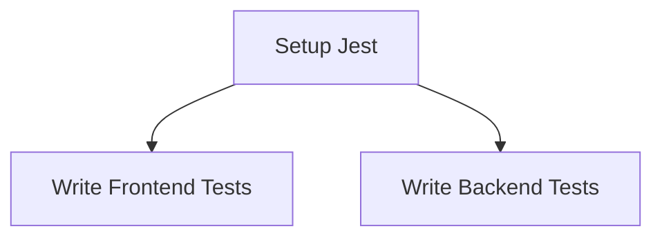

# Multi-Agent Task Coordination System

This document explains how tasks are assigned and coordinated among multiple AI agents in the Bulk Grillers Pride codebase.

## Overview

The system uses a centralized task board with specialized agents, each having specific skills and ownership boundaries. Tasks are tracked, assigned, and coordinated through a combination of markdown files, JSON lock files, and custom commands.

## Agent Roles and Specializations

### 1. Frontend Agent (`frontend-agent`)
- **Primary Skills**: react, nextjs, tailwind, jest, ui-components
- **Secondary Skills**: typescript, testing
- **Never Touch**: convex-schema, database
- **Owns**: `apps/web/` directory (excluding backend logic)

### 2. Backend Agent (`backend-agent`)
- **Primary Skills**: convex, database, schema, api, typescript
- **Secondary Skills**: testing, performance
- **Never Touch**: ui-components, styles
- **Owns**: `convex/` directory

### 3. Infrastructure Agent (`infra-agent`)
- **Primary Skills**: jest, ci-cd, eslint, turbo, npm
- **Secondary Skills**: testing, typescript
- **Never Touch**: business-logic, ui
- **Owns**: Root config files, `.github/`, `.husky/`, build tooling

### 4. Quality Agent (`quality-agent`)
- **Primary Skills**: testing, coverage, performance, security
- **Secondary Skills**: typescript, review
- **Never Touch**: production-code
- **Focus**: Test creation and quality assurance

### 5. Documentation Agent (`docs-agent`)
- **Primary Skills**: markdown, jsdoc, diagrams, guides
- **Secondary Skills**: writing
- **Never Touch**: code-logic
- **Owns**: `docs/`, README files, documentation

### 6. Migration Agent (`migration-agent`)
- **Primary Skills**: schema-migration, data-transform, rollback
- **Secondary Skills**: database, testing
- **Never Touch**: ui, styles
- **Focus**: Database migrations and data transformations

## Task Board Structure (`AGENTS_BOARD.md`)

### Task Status Workflow
```
📋 unassigned → ✅ assigned → 🏃 in-progress → ✔️ done
                                  ↓
                              ⏸️ blocked
```

- **📋 unassigned**: Available for any qualified agent
- **✅ assigned**: Assigned to an agent but not started
- **🏃 in-progress**: Agent actively working
- **⏸️ blocked**: Waiting on dependencies
- **✨ ready**: Dependencies met, can be claimed
- **✔️ done**: Completed

### Task Table Format
```markdown
| ID  | Task                | Required Skills      | Owner         | Status       | Priority | Hours |
| --- | ------------------- | ------------------- | ------------- | ------------ | -------- | ----- |
| T1  | Setup Jest Config   | jest, npm, ci-cd    | infra-agent   | ✔️ done      | P0       | 2     |
```

### Task Dependencies
Tasks can have dependencies tracked in a Mermaid graph:


## File Locking System (`.locks/file-locks.json`)

Prevents concurrent edits to critical files:

```json
{
  "locks": {
    "package.json": null,           // null = unlocked
    "convex/schema.ts": "backend-agent",  // locked by backend-agent
    "turbo.json": null
  }
}
```

### Lock Tiers
- **Tier 1**: Critical files requiring locks (package.json, schema files)
- **Tier 2 Advisory**: Important files with advisory locks

## Task Commands

Commands are located in `.claude/commands/` and can be executed to manage tasks:

### 1. `/check-tasks`
Shows tasks appropriate for the current agent based on:
- Current working directory (determines agent identity)
- Agent skills matching task requirements
- Task status (assigned or unassigned)

### 2. `/claim-task <id>`
Claims an unassigned task:
- Updates task owner to current agent
- Changes status to "in-progress"
- Checks skill compatibility

### 3. `/complete-task <id> <summary>`
Marks a task as done:
- Updates status to "done"
- Adds completion summary to agent messages
- Updates agent metrics

### 4. `/assign-task <id> <agent>`
Assigns task to specific agent:
- Updates owner field
- Changes status to "assigned"
- Used by orchestrator for task distribution

## Agent Coordination Rules

### 1. Task Claiming
- Check required skills match your capabilities
- Verify no anti-skills conflict
- Check file locks before starting work
- Update status immediately when starting

### 2. File Editing
- Check `.locks/file-locks.json` before editing Tier-1 files
- Respect ownership boundaries (never edit files outside your domain)
- Use proper Git workflow (status → branch → fetch → pull)

### 3. Communication
- Update AGENTS_BOARD.md with progress messages
- Include completion summaries when finishing tasks
- Alert other agents about blockers or dependencies

### 4. Testing Requirements
- Run tests before marking tasks complete
- Follow evidence-based language ("testing confirms", "metrics show")
- Document test results in completion messages

## Performance Tracking (`.agent-metrics/metrics.json`)

Tracks agent performance metrics:
```json
{
  "agents": {},
  "infra-agent": {
    "tasks_completed": 3,
    "total_time": 0
  }
}
```

## Workflow Example

1. **Orchestrator** identifies work needed:
   ```
   **orchestrator** (2025-07-17): 🚨 CRITICAL: CSV Import Schema Validation Error Detected!
   - **backend-agent**: T41 - Fix ImportJobs Schema Missing Fields (P0, 1 hour)
   ```

2. **Agent claims task**:
   - Runs `/check-tasks` to see available work
   - Uses `/claim-task T41` to claim
   - Status changes to "in-progress"

3. **Agent works**:
   - Checks file locks
   - Makes necessary changes
   - Runs tests

4. **Agent completes**:
   - Uses `/complete-task T41 "Fixed schema validation..."`
   - Updates AGENTS_BOARD.md with completion message
   - Metrics are updated

## Best Practices

### 1. Task Granularity
- Break large tasks into smaller, manageable pieces
- Each task should be completable in one session
- Clear success criteria

### 2. Skill Matching
- Tasks should list all required skills
- Anti-skills prevent wrong agent assignment
- Secondary skills indicate helpful but not required

### 3. Priority Management
- P0: Critical blockers
- P1: Important features
- P2: Nice-to-have improvements

### 4. Evidence-Based Progress
- Use concrete language ("testing confirms", "benchmark shows")
- Avoid absolutes ("always", "never", "best")
- Document decisions with rationale

## SuperClaude Integration

Each agent has SuperClaude configuration in their CLAUDE-{agent}.md file:
- Specific command recommendations (`/analyze --arch --seq`)
- Persona activations (`--persona-architect`)
- MCP server usage (`--c7` for documentation)
- Evidence standards and language requirements

## Common Scenarios

### 1. Starting Work
```bash
# Check available tasks
/check-tasks

# Claim a task
/claim-task T55

# Update status in AGENTS_BOARD.md
```

### 2. Handling Blockers
```markdown
**frontend-agent** (2025-07-17): T55 blocked - waiting for backend API (T53) to be completed
```

### 3. Cross-Agent Dependencies
- Frontend waits for backend APIs
- All agents wait for infrastructure setup
- Documentation follows implementation

### 4. Parallel Work
Multiple agents can work simultaneously on non-conflicting tasks:
- Frontend on UI components
- Backend on API endpoints  
- Infrastructure on build tools
- Documentation on guides

This coordination system enables efficient parallel development while preventing conflicts and ensuring quality through specialized expertise.