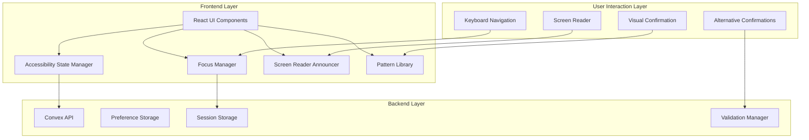
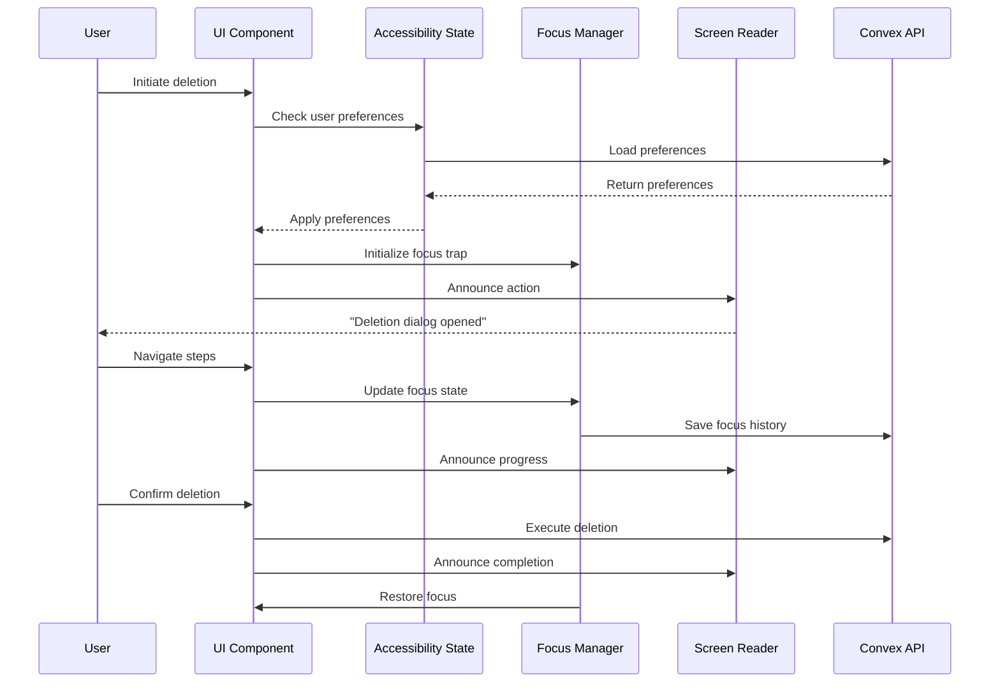
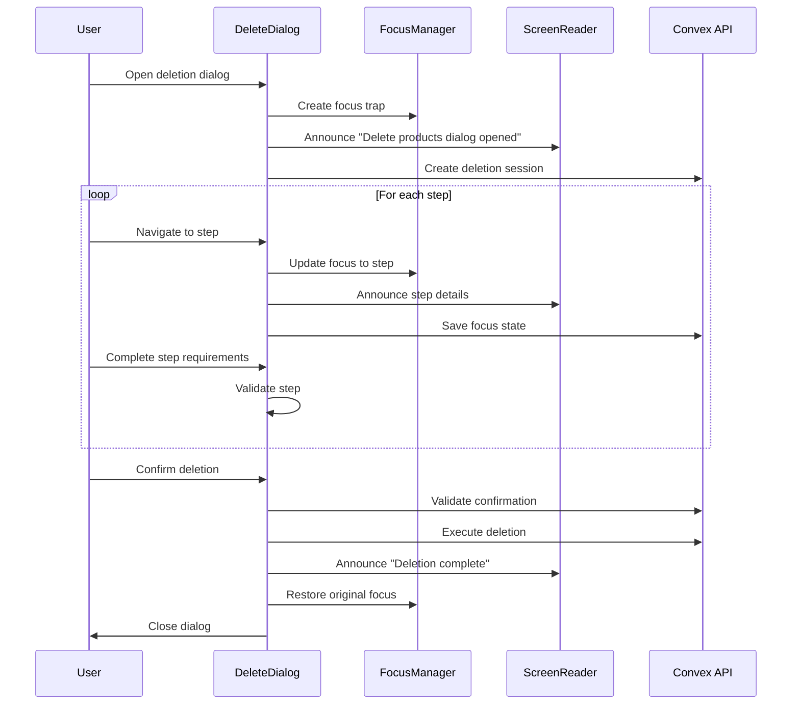
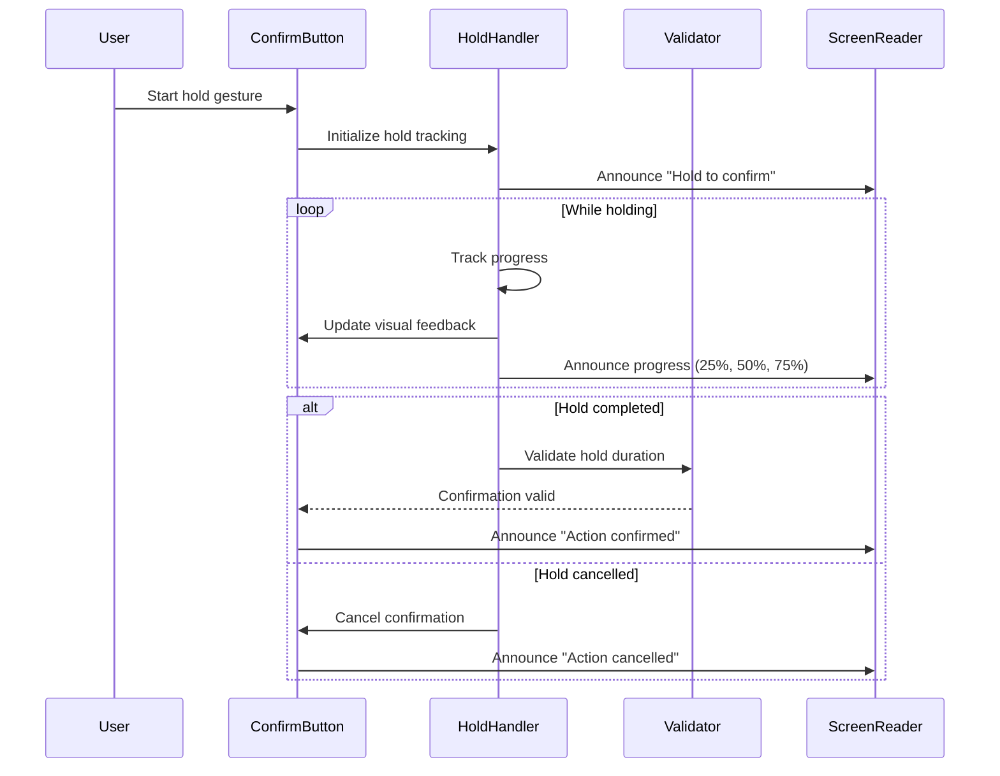

# Accessibility Architecture for Deletion Flow

## Executive Summary

This document defines a comprehensive accessibility architecture for the bulk-grillers-pride deletion flow, ensuring WCAG 2.1 AA compliance and inclusive design. The architecture introduces five core systems: accessibility state management, pattern-based severity indicators, alternative confirmation methods, focus management, and screen reader integration. These systems work together to provide a fully accessible deletion experience that supports keyboard navigation, screen readers, and various user preferences while maintaining security and data integrity.

## System Architecture

### High-Level Architecture



### Component Interaction Diagram



## Data Model Specifications

### Core Entities

```typescript
// User Accessibility Preferences
interface UserAccessibilityPreferences {
  userId: Id<"users">;
  preferences: {
    reducedMotion: boolean;
    highContrast: boolean;
    screenReaderActive: boolean;
    keyboardNavigation: boolean;
    preferredConfirmationMethod: ConfirmationMethod;
    focusIndicatorStyle: 'default' | 'high-visibility' | 'custom';
    announcementVerbosity: 'minimal' | 'standard' | 'verbose';
  };
  updatedAt: number;
}

// Deletion Session State
interface DeletionSession {
  sessionId: string;
  userId: Id<"users">;
  organizationId: Id<"organizations">;
  state: 'active' | 'completed' | 'cancelled';
  currentStep: DeletionStep;
  selectedProducts: Id<"products">[];
  confirmationMethod: ConfirmationMethod;
  startedAt: number;
  completedAt?: number;
  focusHistory: FocusState[];
}

// Focus State Tracking
interface FocusState {
  elementId: string;
  timestamp: number;
  context: 'modal' | 'wizard' | 'table' | 'form';
  scrollPosition?: { x: number; y: number };
}

// Pattern Definition
interface PatternDefinition {
  id: string;
  name: string;
  severity: SeverityLevel;
  svgPattern: string;
  highContrastVariant: string;
  colorScheme: {
    primary: string;
    secondary: string;
    highContrast: {
      primary: string;
      secondary: string;
    };
  };
  textureDescription: string;
}
```

### Enumerations

```typescript
enum ConfirmationMethod {
  STANDARD_CLICK = 'standard_click',
  HOLD_TO_CONFIRM = 'hold_to_confirm',
  TYPE_TO_CONFIRM = 'type_to_confirm',
  BIOMETRIC = 'biometric',
  VOICE = 'voice',
  PATTERN_DRAW = 'pattern_draw'
}

enum SeverityLevel {
  INFO = 'info',
  WARNING = 'warning',
  DANGER = 'danger',
  CRITICAL = 'critical'
}

enum DeletionStep {
  REVIEW_CONSEQUENCES = 'review_consequences',
  SELECT_OPTIONS = 'select_options',
  CONFIRM = 'confirm',
  PROCESSING = 'processing',
  COMPLETE = 'complete'
}
```

## API Contracts

### Preference Management

```typescript
// Get user accessibility preferences
export const getAccessibilityPreferences = query({
  handler: async (ctx) => {
    const user = await ctx.auth.getUserIdentity();
    if (!user) return null;
    
    return await ctx.db
      .query("accessibilityPreferences")
      .withIndex("by_user", q => q.eq("userId", user._id))
      .unique();
  }
});

// Update user accessibility preferences
export const updateAccessibilityPreferences = mutation({
  args: {
    preferences: v.object({
      reducedMotion: v.boolean(),
      highContrast: v.boolean(),
      screenReaderActive: v.boolean(),
      keyboardNavigation: v.boolean(),
      preferredConfirmationMethod: v.string(),
      focusIndicatorStyle: v.string(),
      announcementVerbosity: v.string()
    })
  },
  handler: async (ctx, args) => {
    // Implementation shown in architecture
  }
});
```

### Session Management

```typescript
// Create deletion session
export const createDeletionSession = mutation({
  args: {
    selectedProducts: v.array(v.id("products")),
    confirmationMethod: v.string()
  },
  handler: async (ctx, args) => {
    const sessionId = generateSessionId();
    const user = await ctx.auth.getUserIdentity();
    
    await ctx.db.insert("deletionSessions", {
      sessionId,
      userId: user._id,
      organizationId: user.organizationId,
      state: 'active',
      currentStep: DeletionStep.REVIEW_CONSEQUENCES,
      selectedProducts: args.selectedProducts,
      confirmationMethod: args.confirmationMethod,
      startedAt: Date.now(),
      focusHistory: []
    });
    
    return sessionId;
  }
});

// Update session focus state
export const updateSessionFocus = mutation({
  args: {
    sessionId: v.string(),
    focusState: v.object({
      elementId: v.string(),
      timestamp: v.number(),
      context: v.string(),
      scrollPosition: v.optional(v.object({
        x: v.number(),
        y: v.number()
      }))
    })
  },
  handler: async (ctx, args) => {
    // Implementation
  }
});
```

### Validation Endpoints

```typescript
// Validate alternative confirmation
export const validateConfirmation = mutation({
  args: {
    sessionId: v.string(),
    method: v.string(),
    data: v.any()
  },
  handler: async (ctx, args) => {
    const session = await ctx.db
      .query("deletionSessions")
      .withIndex("by_session", q => q.eq("sessionId", args.sessionId))
      .unique();
      
    if (!session) throw new Error("Session not found");
    
    switch (args.method) {
      case ConfirmationMethod.TYPE_TO_CONFIRM:
        return validateTypeConfirmation(args.data);
      case ConfirmationMethod.HOLD_TO_CONFIRM:
        return validateHoldConfirmation(args.data);
      case ConfirmationMethod.BIOMETRIC:
        return validateBiometricConfirmation(args.data);
      default:
        return true;
    }
  }
});
```

## Sequence Diagrams

### Multi-Step Deletion Flow



### Alternative Confirmation Flow



## Technical Analysis

### Performance Requirements

| Metric | Target | Measurement Method |
|--------|--------|-------------------|
| Focus transition time | <50ms | Performance.now() between focus events |
| Screen reader announcement delay | <100ms | Time from action to aria-live update |
| Pattern rendering | <16ms | Frame time for pattern application |
| Preference loading | <200ms | API response time |
| Session state sync | <500ms | Round-trip to Convex |

### Scalability Considerations

1. **Pattern Library Optimization**
   - SVG patterns cached in memory
   - Lazy loading for complex patterns
   - CSS custom properties for dynamic theming

2. **State Management**
   - Local state for immediate UI updates
   - Debounced sync to backend
   - Optimistic updates with rollback

3. **Announcement Queue**
   - Priority-based queuing
   - Automatic deduplication
   - Rate limiting for verbose mode

### Security Threat Model

1. **Confirmation Method Security**
   - Hold-to-confirm: Prevent automation via touch event validation
   - Type-to-confirm: Rate limiting and session binding
   - Biometric: Fallback methods for failed authentication

2. **Session Security**
   - Session timeout after 30 minutes
   - CSRF protection on all mutations
   - Audit logging for all deletions

## Edge Cases and Failure Modes

### 1. Screen Reader Conflicts
**Issue**: Multiple rapid announcements causing confusion
**Solution**: Priority queue with deduplication and minimum delay between announcements

### 2. Focus Loss During Navigation
**Issue**: Browser navigation or refresh losing focus state
**Solution**: Persist focus state to session storage, restore on mount

### 3. Pattern Rendering Failures
**Issue**: SVG patterns not rendering in certain browsers
**Solution**: CSS fallback with distinct borders and icons

### 4. Confirmation Method Unavailability
**Issue**: Biometric not available on device
**Solution**: Automatic fallback to next preferred method

### 5. High Contrast Mode Conflicts
**Issue**: OS high contrast overriding custom patterns
**Solution**: Detect high contrast mode, switch to compatible patterns

## Implementation Plan

### Phase 1: Core Infrastructure (Week 1-2)
```yaml
tasks:
  - id: T1
    description: "Implement accessibility state management"
    effort: "8 hours"
    dependencies: []
    assigned_to: backend-agent
  
  - id: T2
    description: "Create Convex schema for preferences"
    effort: "4 hours"
    dependencies: []
    assigned_to: backend-agent
  
  - id: T3
    description: "Build React context for accessibility"
    effort: "6 hours"
    dependencies: [T1]
    assigned_to: frontend-agent
```

### Phase 2: Visual Patterns (Week 2-3)
```yaml
tasks:
  - id: T4
    description: "Create SVG pattern library"
    effort: "6 hours"
    dependencies: []
    assigned_to: frontend-agent
  
  - id: T5
    description: "Implement pattern application system"
    effort: "8 hours"
    dependencies: [T4]
    assigned_to: frontend-agent
  
  - id: T6
    description: "Add high contrast variants"
    effort: "4 hours"
    dependencies: [T4]
    assigned_to: frontend-agent
```

### Phase 3: Alternative Confirmations (Week 3-4)
```yaml
tasks:
  - id: T7
    description: "Build hold-to-confirm component"
    effort: "8 hours"
    dependencies: [T3]
    assigned_to: frontend-agent
  
  - id: T8
    description: "Implement type-to-confirm validation"
    effort: "4 hours"
    dependencies: [T3]
    assigned_to: frontend-agent
  
  - id: T9
    description: "Add confirmation method API"
    effort: "6 hours"
    dependencies: [T2]
    assigned_to: backend-agent
```

### Phase 4: Focus Management (Week 4-5)
```yaml
tasks:
  - id: T10
    description: "Implement focus trap system"
    effort: "6 hours"
    dependencies: [T3]
    assigned_to: frontend-agent
  
  - id: T11
    description: "Build wizard focus controller"
    effort: "8 hours"
    dependencies: [T10]
    assigned_to: frontend-agent
  
  - id: T12
    description: "Add focus state persistence"
    effort: "4 hours"
    dependencies: [T2, T10]
    assigned_to: backend-agent
```

### Phase 5: Screen Reader Integration (Week 5-6)
```yaml
tasks:
  - id: T13
    description: "Create announcement queue system"
    effort: "6 hours"
    dependencies: [T3]
    assigned_to: frontend-agent
  
  - id: T14
    description: "Build deletion flow announcer"
    effort: "8 hours"
    dependencies: [T13]
    assigned_to: frontend-agent
  
  - id: T15
    description: "Add semantic HTML structure"
    effort: "4 hours"
    dependencies: []
    assigned_to: frontend-agent
```

### Phase 6: Testing & Validation (Week 6-7)
```yaml
tasks:
  - id: T16
    description: "Create accessibility test utilities"
    effort: "8 hours"
    dependencies: [T15]
    assigned_to: quality-agent
  
  - id: T17
    description: "Implement automated a11y tests"
    effort: "12 hours"
    dependencies: [T16]
    assigned_to: quality-agent
  
  - id: T18
    description: "Conduct screen reader testing"
    effort: "8 hours"
    dependencies: [T15]
    assigned_to: quality-agent
```

## Success Criteria

### Functional Requirements
- [ ] All interactive elements keyboard accessible
- [ ] Screen reader announces all state changes
- [ ] Visual patterns distinguish severity levels
- [ ] Alternative confirmation methods functional
- [ ] Focus management maintains user context
- [ ] Preferences persist across sessions

### Performance Metrics
- [ ] Focus transitions <50ms
- [ ] Announcements <100ms delay
- [ ] Pattern rendering at 60fps
- [ ] No memory leaks in long sessions

### Accessibility Compliance
- [ ] WCAG 2.1 AA compliant (automated testing)
- [ ] Keyboard navigation complete
- [ ] Screen reader testing passed (NVDA, JAWS, VoiceOver)
- [ ] Color contrast ratios met (4.5:1 minimum)
- [ ] Focus indicators visible

### User Experience
- [ ] Multiple confirmation methods available
- [ ] Clear progress indication
- [ ] Consistent navigation patterns
- [ ] Error recovery paths defined
- [ ] Help text accessible

## Performance Monitoring

```typescript
// Performance tracking implementation
interface AccessibilityMetrics {
  focusTransitions: {
    avg: number;
    p95: number;
    failures: number;
  };
  announcements: {
    queueDepth: number;
    avgDelay: number;
    dropped: number;
  };
  patternRendering: {
    fps: number;
    frameDrops: number;
  };
  preferences: {
    loadTime: number;
    syncFailures: number;
  };
}

// Monitoring dashboard integration
export const trackAccessibilityMetrics = () => {
  // Send to monitoring service
};
```

## Dependencies

### Frontend Dependencies
- react-aria-components: ^3.28.0 (Focus management)
- focus-trap-react: ^10.2.0 (Focus trapping)
- axe-core: ^4.8.0 (Accessibility testing)

### Backend Dependencies
- Convex schema extensions for preferences
- Session management infrastructure
- Audit logging system

### Design System Updates
- Pattern library integration
- Focus indicator styles
- High contrast theme variants

## References

- [WCAG 2.1 Guidelines](https://www.w3.org/WAI/WCAG21/quickref/)
- [React Aria Documentation](https://react-spectrum.adobe.com/react-aria/)
- [Current Implementation](apps/web/src/components/products/delete-product-dialog.tsx)
- [UX Review Document](docs/deletion-flow-ux-review.design.md)
- [Convex Documentation](https://docs.convex.dev/)

## Appendix: Component Examples

### Pattern-Enhanced Severity Indicator
```tsx
const SeverityIndicator: React.FC<{
  severity: SeverityLevel;
  label: string;
}> = ({ severity, label }) => {
  const { pattern, colors } = usePattern(severity);
  const { announce } = useAccessibility();
  
  return (
    <div
      className="severity-indicator"
      style={{
        backgroundColor: colors.secondary,
        backgroundImage: pattern.patternUrl,
        color: colors.primary
      }}
      role="img"
      aria-label={`${severity} severity: ${label}`}
      onFocus={() => announce(pattern.textureDescription)}
    >
      {label}
    </div>
  );
};
```

### Accessible Deletion Wizard
```tsx
const DeletionWizard: React.FC = () => {
  const { preferences } = useAccessibility();
  const focusController = useWizardFocus(DELETION_STEPS);
  const announcer = useDeletionAnnouncer();
  
  return (
    <WizardContainer
      steps={DELETION_STEPS}
      onStepChange={announcer.announceStepChange}
      focusController={focusController}
      confirmationMethod={preferences.preferredConfirmationMethod}
    />
  );
};
```