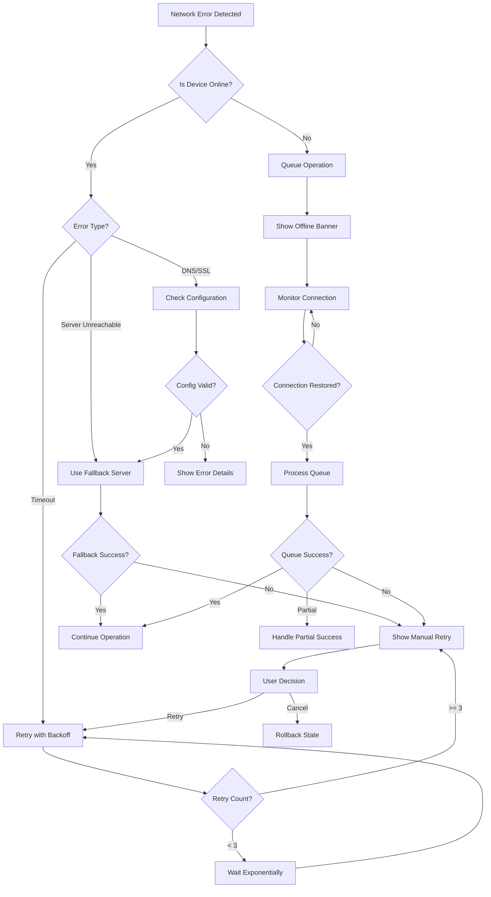
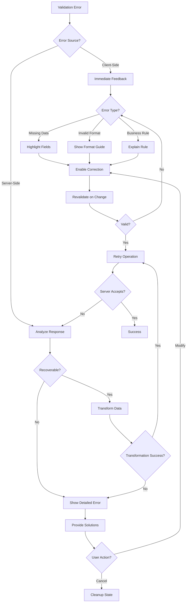
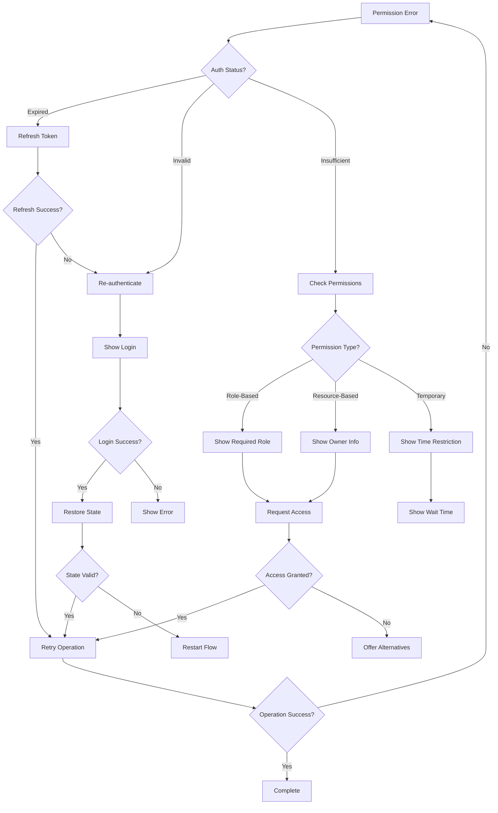
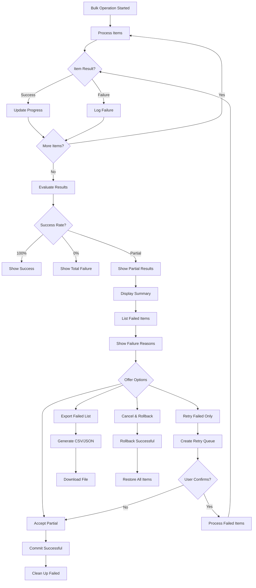
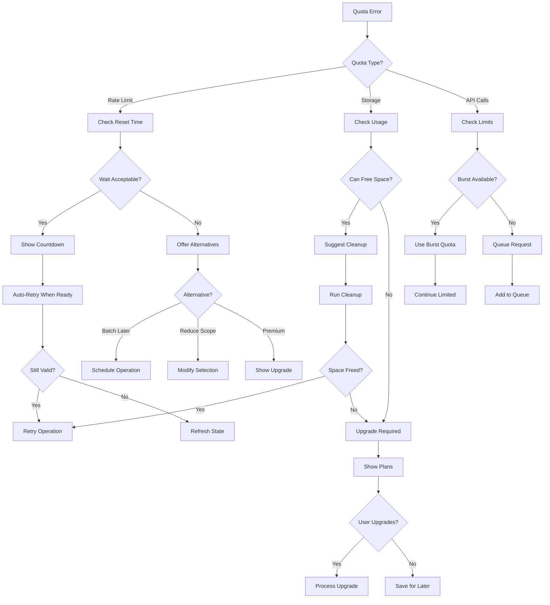
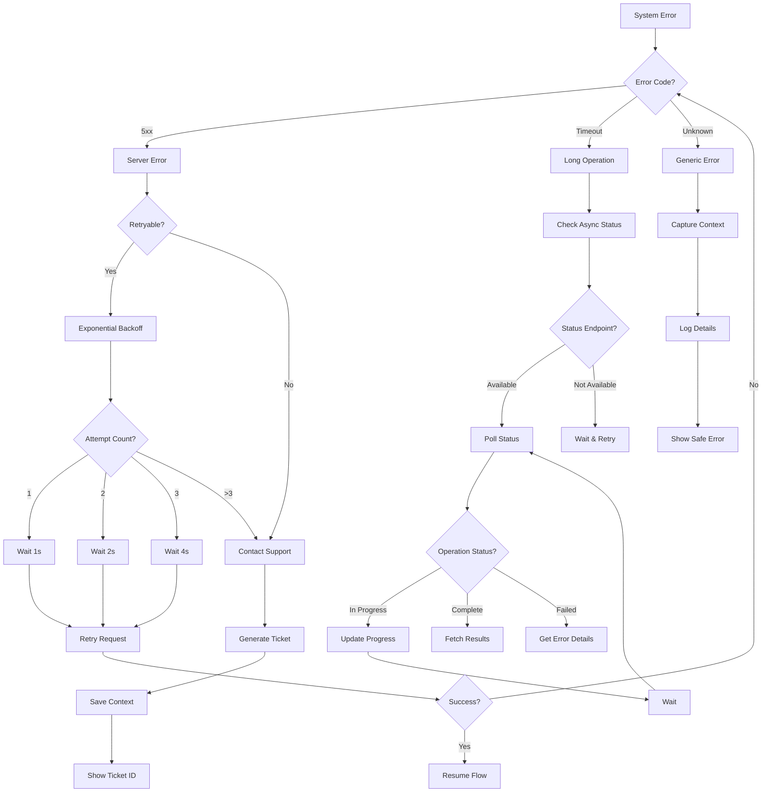
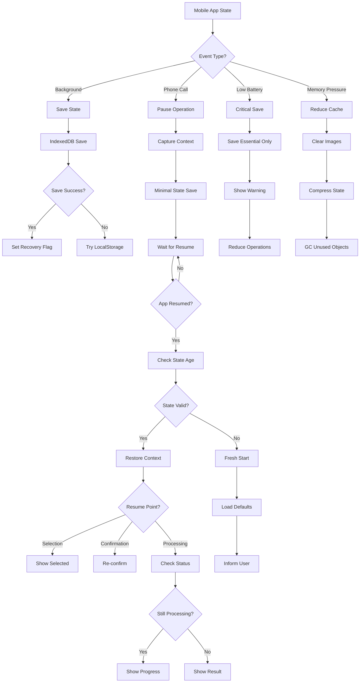

# Deletion Error Recovery Flow Charts

**Author**: systems-design-agent  
**Date**: 2025-07-20  
**Related**: #56 - Multi-Step Deletion State Management Architecture

## Overview

This document provides comprehensive error recovery flow charts for the deletion system, covering various failure scenarios, recovery strategies, and user experience considerations.

## Error Classification

### Error Severity Levels

```typescript
enum ErrorSeverity {
  RECOVERABLE = 'recoverable',      // Can be retried automatically
  USER_RECOVERABLE = 'user_recoverable', // Requires user intervention
  PARTIAL_FAILURE = 'partial_failure',   // Some items succeeded, some failed
  CRITICAL = 'critical',            // Unrecoverable, requires support
}

enum ErrorCategory {
  NETWORK = 'network',              // Connection issues
  VALIDATION = 'validation',        // Invalid data or state
  PERMISSION = 'permission',        // Authorization failures
  CONFLICT = 'conflict',           // Concurrent modification
  QUOTA = 'quota',                // Storage or rate limits
  SYSTEM = 'system',              // Server errors
}
```

## Primary Error Recovery Flows

### 1. Network Error Recovery Flow



### 2. Validation Error Recovery Flow



### 3. Permission Error Recovery Flow



### 4. Partial Failure Recovery Flow



### 5. Quota/Rate Limit Recovery Flow



### 6. System Error Recovery Flow



## Mobile-Specific Error Recovery

### 7. Mobile Interruption Recovery Flow



## Error Recovery Strategies

### Automatic Recovery Matrix

| Error Type | Strategy | Max Attempts | Backoff | User Notification |
|------------|----------|--------------|---------|-------------------|
| Network Timeout | Exponential Retry | 3 | 1s, 2s, 4s | After 2nd attempt |
| Rate Limit | Wait & Retry | 1 | Until reset | Immediate with countdown |
| Server 503 | Linear Retry | 5 | 5s | After 3rd attempt |
| Auth Expired | Refresh Token | 1 | None | On failure |
| Validation | None | 0 | N/A | Immediate |
| Permission | None | 0 | N/A | Immediate |
| Conflict | Merge or Retry | 1 | None | Immediate |

### User Recovery Options

```typescript
interface RecoveryOption {
  id: string;
  label: string;
  icon: string;
  description: string;
  action: () => Promise<void>;
  isRecommended?: boolean;
  requiresConfirmation?: boolean;
}

const getRecoveryOptions = (error: DeletionError): RecoveryOption[] => {
  switch (error.category) {
    case ErrorCategory.NETWORK:
      return [
        {
          id: 'retry',
          label: 'Try Again',
          icon: 'refresh',
          description: 'Retry the operation',
          action: async () => retryOperation(),
          isRecommended: true
        },
        {
          id: 'offline',
          label: 'Save for Later',
          icon: 'download',
          description: 'Queue when online',
          action: async () => queueForLater()
        }
      ];
      
    case ErrorCategory.PARTIAL_FAILURE:
      return [
        {
          id: 'retry-failed',
          label: 'Retry Failed Items',
          icon: 'refresh',
          description: `Retry ${error.failedCount} failed items`,
          action: async () => retryFailed(),
          isRecommended: true
        },
        {
          id: 'export-failed',
          label: 'Export Failed List',
          icon: 'download',
          description: 'Download list of failed items',
          action: async () => exportFailedItems()
        },
        {
          id: 'accept-partial',
          label: 'Continue with Successful',
          icon: 'check',
          description: `Keep ${error.successCount} successful deletions`,
          action: async () => acceptPartial()
        }
      ];
      
    // ... more categories
  }
};
```

## Error Tracking and Analytics

### Error Metrics Collection

```typescript
interface ErrorMetrics {
  errorId: string;
  timestamp: number;
  category: ErrorCategory;
  severity: ErrorSeverity;
  
  // Context
  operation: string;
  userId: string;
  organizationId: string;
  sessionId: string;
  
  // Error details
  code: string;
  message: string;
  stack?: string;
  
  // Recovery
  recoveryAttempted: boolean;
  recoveryStrategy: string;
  recoverySuccess: boolean;
  recoveryDuration?: number;
  
  // User impact
  itemsAffected: number;
  userAction: 'retry' | 'cancel' | 'ignore' | 'support';
  
  // System state
  deviceInfo: {
    platform: string;
    version: string;
    connection: 'wifi' | '4g' | '3g' | 'offline';
    battery?: number;
    memory?: number;
  };
}

// Track errors for analysis
const trackError = async (error: DeletionError, context: ErrorContext) => {
  const metrics: ErrorMetrics = {
    errorId: generateErrorId(),
    timestamp: Date.now(),
    category: error.category,
    severity: error.severity,
    // ... collect all metrics
  };
  
  // Send to analytics
  await analytics.track('deletion_error', metrics);
  
  // Store for support
  await errorStore.save(metrics);
};
```

### Error Recovery Success Rates

```typescript
interface RecoveryAnalytics {
  // Success rates by strategy
  strategySuccessRates: {
    exponentialRetry: { attempts: number; successes: number };
    tokenRefresh: { attempts: number; successes: number };
    offlineQueue: { attempts: number; successes: number };
    userRetry: { attempts: number; successes: number };
  };
  
  // Recovery time metrics
  averageRecoveryTime: {
    network: number;
    validation: number;
    permission: number;
    system: number;
  };
  
  // User behavior
  userActions: {
    immediateRetry: number;
    delayedRetry: number;
    cancellation: number;
    supportContact: number;
  };
}
```

## Implementation Guidelines

### 1. Error Boundary Implementation

```tsx
export class DeletionErrorBoundary extends React.Component<
  { children: React.ReactNode },
  { hasError: boolean; error: Error | null }
> {
  state = { hasError: false, error: null };
  
  static getDerivedStateFromError(error: Error) {
    return { hasError: true, error };
  }
  
  componentDidCatch(error: Error, errorInfo: ErrorInfo) {
    // Log to monitoring service
    errorReporter.captureException(error, {
      contexts: {
        react: { componentStack: errorInfo.componentStack }
      }
    });
  }
  
  render() {
    if (this.state.hasError) {
      return (
        <ErrorRecoveryUI
          error={this.state.error}
          onRecover={() => this.setState({ hasError: false })}
        />
      );
    }
    
    return this.props.children;
  }
}
```

### 2. Progressive Error Recovery

```typescript
export class ProgressiveErrorRecovery {
  private attempts = 0;
  private strategies: RecoveryStrategy[] = [
    new ImmediateRetryStrategy(),
    new ExponentialBackoffStrategy(),
    new FallbackServerStrategy(),
    new OfflineQueueStrategy(),
    new UserInterventionStrategy()
  ];
  
  async recover(error: DeletionError, context: OperationContext) {
    for (const strategy of this.strategies) {
      if (strategy.canHandle(error)) {
        try {
          const result = await strategy.recover(error, context);
          if (result.success) {
            return result;
          }
        } catch (strategyError) {
          // Log strategy failure, try next
          console.error(`Strategy ${strategy.name} failed:`, strategyError);
        }
      }
    }
    
    // All strategies failed
    throw new UnrecoverableError(error);
  }
}
```

## Testing Error Recovery

### Error Simulation Framework

```typescript
export class ErrorSimulator {
  static simulateNetworkError() {
    return new NetworkError('ERR_NETWORK_TIMEOUT', 'Request timeout');
  }
  
  static simulatePartialFailure(total: number, failed: number) {
    return new PartialFailureError(
      'ERR_PARTIAL_FAILURE',
      `${failed} of ${total} operations failed`,
      { total, failed, succeeded: total - failed }
    );
  }
  
  static simulateQuotaExceeded(quotaType: 'rate' | 'storage') {
    return new QuotaError(
      'ERR_QUOTA_EXCEEDED',
      `${quotaType} quota exceeded`,
      { quotaType, resetAt: Date.now() + 3600000 }
    );
  }
}

// Use in tests
describe('Error Recovery', () => {
  it('should recover from network timeout', async () => {
    const error = ErrorSimulator.simulateNetworkError();
    const recovery = new ProgressiveErrorRecovery();
    
    const result = await recovery.recover(error, context);
    expect(result.success).toBe(true);
    expect(result.strategy).toBe('exponential-backoff');
  });
});
```

## Summary

This error recovery system provides:

1. **Comprehensive Coverage**: Handles all common error scenarios
2. **Progressive Recovery**: Multiple strategies tried in sequence
3. **User-Friendly**: Clear options and feedback for users
4. **Mobile-Optimized**: Special handling for mobile interruptions
5. **Analytics-Driven**: Metrics collection for continuous improvement
6. **Testable**: Simulation framework for thorough testing

The implementation prioritizes user experience while maintaining data integrity and system reliability across all platforms and network conditions.