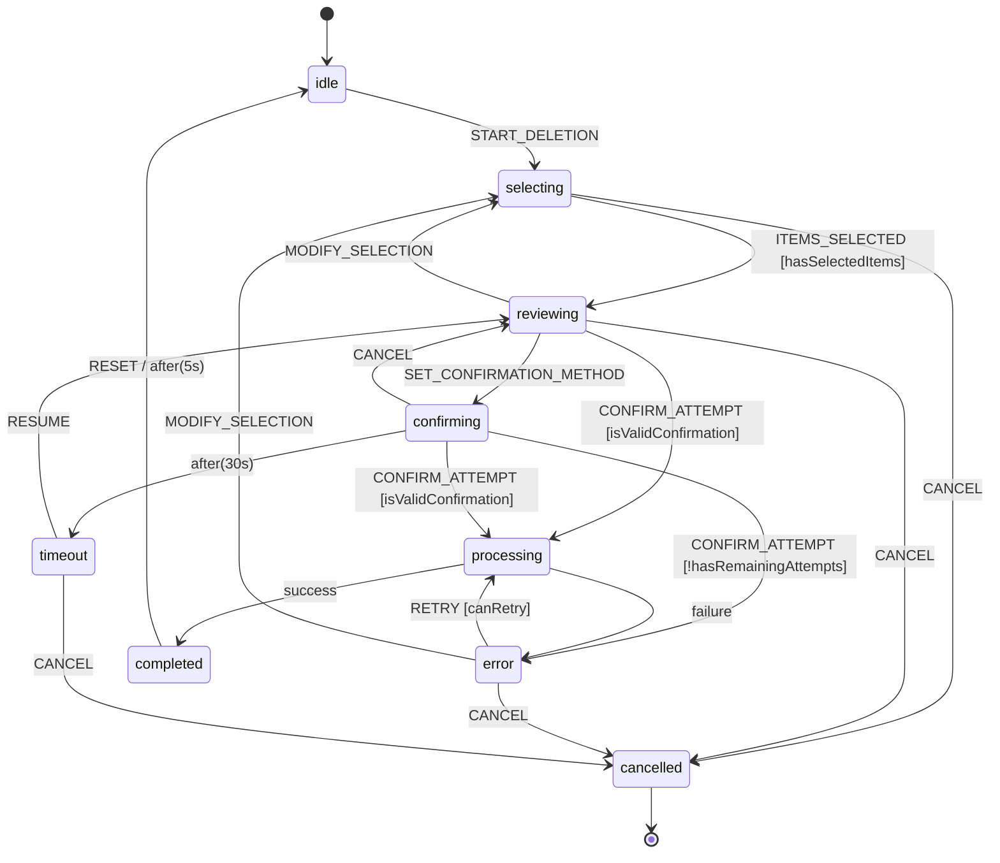
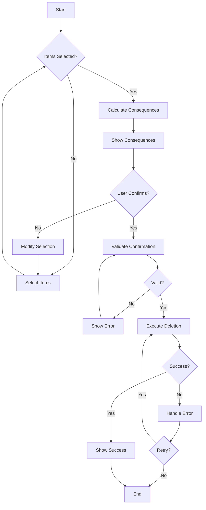

# Deletion Flow State Machine Specification

**Author**: systems-design-agent  
**Date**: 2025-07-20  
**Related**: #56 - Multi-Step Deletion State Management Architecture

## Overview

This document provides detailed state machine specifications for the deletion flow, including XState configuration, guards, actions, and services ready for implementation.

## State Machine Definition

### Complete XState Machine Configuration

```typescript
import { createMachine, assign } from 'xstate';

export interface DeletionContext {
  sessionId: string | null;
  selectedItems: string[];
  confirmationMethod: ConfirmationMethod;
  confirmationData: ConfirmationData | null;
  consequences: ConsequenceInfo[];
  dependencies: DependencyInfo[];
  progress: {
    total: number;
    completed: number;
    failed: number;
    currentItem: string | null;
  };
  error: Error | null;
  retryCount: number;
  lastActivityAt: number;
}

export type DeletionEvent =
  | { type: 'START_DELETION' }
  | { type: 'SELECT_ITEM'; itemId: string }
  | { type: 'DESELECT_ITEM'; itemId: string }
  | { type: 'SELECT_ALL'; itemIds: string[] }
  | { type: 'DESELECT_ALL' }
  | { type: 'ITEMS_SELECTED' }
  | { type: 'MODIFY_SELECTION' }
  | { type: 'SET_CONFIRMATION_METHOD'; method: ConfirmationMethod }
  | { type: 'CONFIRM_ATTEMPT'; data: ConfirmationData }
  | { type: 'CONFIRMED' }
  | { type: 'PROGRESS_UPDATE'; progress: Partial<DeletionContext['progress']> }
  | { type: 'SUCCESS' }
  | { type: 'FAILED'; error: Error }
  | { type: 'RETRY' }
  | { type: 'CANCEL' }
  | { type: 'TIMEOUT' }
  | { type: 'RESUME' }
  | { type: 'RESET' };

export const deletionMachine = createMachine<DeletionContext, DeletionEvent>({
  id: 'deletion',
  initial: 'idle',
  context: {
    sessionId: null,
    selectedItems: [],
    confirmationMethod: ConfirmationMethod.STANDARD,
    confirmationData: null,
    consequences: [],
    dependencies: [],
    progress: {
      total: 0,
      completed: 0,
      failed: 0,
      currentItem: null
    },
    error: null,
    retryCount: 0,
    lastActivityAt: Date.now()
  },
  states: {
    idle: {
      on: {
        START_DELETION: {
          target: 'selecting',
          actions: ['initializeSession', 'updateActivity']
        }
      }
    },
    
    selecting: {
      entry: ['persistState'],
      on: {
        SELECT_ITEM: {
          actions: ['addItem', 'updateActivity']
        },
        DESELECT_ITEM: {
          actions: ['removeItem', 'updateActivity']
        },
        SELECT_ALL: {
          actions: ['setAllItems', 'updateActivity']
        },
        DESELECT_ALL: {
          actions: ['clearItems', 'updateActivity']
        },
        ITEMS_SELECTED: {
          target: 'reviewing',
          cond: 'hasSelectedItems',
          actions: ['updateActivity']
        },
        CANCEL: {
          target: 'cancelled'
        }
      }
    },
    
    reviewing: {
      entry: ['calculateConsequences', 'prefetchDependencies', 'persistState'],
      on: {
        MODIFY_SELECTION: {
          target: 'selecting',
          actions: ['updateActivity']
        },
        SET_CONFIRMATION_METHOD: {
          actions: ['setConfirmationMethod', 'updateActivity']
        },
        CONFIRM_ATTEMPT: [
          {
            target: 'processing',
            cond: 'isValidConfirmation',
            actions: ['storeConfirmationData', 'updateActivity']
          },
          {
            target: 'confirming',
            actions: ['incrementConfirmationAttempts', 'updateActivity']
          }
        ],
        CANCEL: {
          target: 'cancelled'
        }
      }
    },
    
    confirming: {
      entry: ['generateNonce', 'startConfirmationTimer', 'persistState'],
      exit: ['clearConfirmationTimer'],
      after: {
        CONFIRMATION_TIMEOUT: {
          target: 'timeout'
        }
      },
      on: {
        CONFIRM_ATTEMPT: [
          {
            target: 'processing',
            cond: 'isValidConfirmation',
            actions: ['storeConfirmationData', 'updateActivity']
          },
          {
            target: 'confirming',
            cond: 'hasRemainingAttempts',
            actions: ['incrementConfirmationAttempts', 'showInvalidConfirmation']
          },
          {
            target: 'error',
            actions: ['setConfirmationError']
          }
        ],
        CANCEL: {
          target: 'reviewing'
        }
      }
    },
    
    processing: {
      entry: ['persistState'],
      invoke: {
        id: 'deletionService',
        src: 'performDeletion',
        onDone: {
          target: 'completed',
          actions: ['handleSuccess', 'queueUndo']
        },
        onError: {
          target: 'error',
          actions: ['handleError', 'prepareRetry']
        }
      },
      on: {
        PROGRESS_UPDATE: {
          actions: ['updateProgress', 'updateActivity']
        }
      }
    },
    
    completed: {
      entry: ['showSuccessNotification', 'refreshUI', 'persistState'],
      after: {
        AUTO_RESET_DELAY: {
          target: 'idle',
          actions: ['cleanup']
        }
      },
      on: {
        RESET: {
          target: 'idle',
          actions: ['cleanup']
        }
      }
    },
    
    error: {
      entry: ['logError', 'showErrorNotification', 'persistState'],
      on: {
        RETRY: {
          target: 'processing',
          cond: 'canRetry',
          actions: ['incrementRetryCount', 'clearError']
        },
        MODIFY_SELECTION: {
          target: 'selecting',
          actions: ['clearError']
        },
        CANCEL: {
          target: 'cancelled'
        }
      }
    },
    
    cancelled: {
      entry: ['cleanupResources', 'clearSession'],
      type: 'final'
    },
    
    timeout: {
      entry: ['saveState', 'showTimeoutNotification'],
      on: {
        RESUME: {
          target: 'reviewing',
          actions: ['restoreState', 'updateActivity']
        },
        CANCEL: {
          target: 'cancelled'
        }
      }
    }
  }
});
```

### Guards Implementation

```typescript
export const deletionMachineGuards = {
  hasSelectedItems: (context: DeletionContext) => {
    return context.selectedItems.length > 0;
  },
  
  isValidConfirmation: (context: DeletionContext, event: any) => {
    const validator = getConfirmationValidator(context.confirmationMethod);
    return validator.validate(event.data, context);
  },
  
  hasRemainingAttempts: (context: DeletionContext) => {
    const MAX_ATTEMPTS = 3;
    return context.retryCount < MAX_ATTEMPTS;
  },
  
  canRetry: (context: DeletionContext) => {
    const MAX_RETRIES = 3;
    const isRetriableError = context.error?.code !== 'PERMANENT_FAILURE';
    return context.retryCount < MAX_RETRIES && isRetriableError;
  }
};
```

### Actions Implementation

```typescript
export const deletionMachineActions = {
  initializeSession: assign({
    sessionId: (context, event) => generateSessionId(),
    lastActivityAt: () => Date.now()
  }),
  
  updateActivity: assign({
    lastActivityAt: () => Date.now()
  }),
  
  addItem: assign({
    selectedItems: (context, event) => [...context.selectedItems, event.itemId]
  }),
  
  removeItem: assign({
    selectedItems: (context, event) => 
      context.selectedItems.filter(id => id !== event.itemId)
  }),
  
  setAllItems: assign({
    selectedItems: (context, event) => event.itemIds
  }),
  
  clearItems: assign({
    selectedItems: []
  }),
  
  setConfirmationMethod: assign({
    confirmationMethod: (context, event) => event.method
  }),
  
  calculateConsequences: async (context) => {
    const consequences = await fetchConsequences(context.selectedItems);
    return assign({ consequences });
  },
  
  prefetchDependencies: async (context) => {
    const dependencies = await fetchDependencies(context.selectedItems);
    return assign({ dependencies });
  },
  
  storeConfirmationData: assign({
    confirmationData: (context, event) => event.data
  }),
  
  incrementRetryCount: assign({
    retryCount: (context) => context.retryCount + 1
  }),
  
  handleSuccess: assign({
    progress: (context, event) => ({
      total: context.selectedItems.length,
      completed: context.selectedItems.length,
      failed: 0,
      currentItem: null
    })
  }),
  
  handleError: assign({
    error: (context, event) => event.data,
    progress: (context) => ({
      ...context.progress,
      failed: context.progress.failed + 1
    })
  }),
  
  updateProgress: assign({
    progress: (context, event) => ({
      ...context.progress,
      ...event.progress
    })
  }),
  
  persistState: (context) => {
    localStorage.setItem(`deletion-session-${context.sessionId}`, 
      JSON.stringify(context)
    );
  },
  
  cleanup: assign({
    sessionId: null,
    selectedItems: [],
    confirmationData: null,
    consequences: [],
    dependencies: [],
    progress: {
      total: 0,
      completed: 0,
      failed: 0,
      currentItem: null
    },
    error: null,
    retryCount: 0
  })
};
```

### Services Implementation

```typescript
export const deletionMachineServices = {
  performDeletion: async (context: DeletionContext) => {
    const { sessionId, selectedItems, confirmationData } = context;
    
    // Create command
    const command = new ExecuteDeletionCommand(
      sessionId!,
      selectedItems,
      confirmationData!
    );
    
    // Execute with progress updates
    const progressCallback = (progress: DeletionProgress) => {
      // Send progress events back to machine
      send({ type: 'PROGRESS_UPDATE', progress });
    };
    
    try {
      const result = await deletionService.execute(command, progressCallback);
      return result;
    } catch (error) {
      throw error;
    }
  }
};
```

## State Persistence and Recovery

### Session Storage Strategy

```typescript
export class DeletionSessionStorage {
  private readonly STORAGE_KEY_PREFIX = 'deletion-session-';
  private readonly SESSION_TIMEOUT = 30 * 60 * 1000; // 30 minutes
  
  async save(sessionId: string, context: DeletionContext): Promise<void> {
    const data: PersistedSession = {
      context,
      version: 1,
      savedAt: Date.now()
    };
    
    // Save to IndexedDB for better persistence
    await this.db.sessions.put({
      id: sessionId,
      data: JSON.stringify(data)
    });
    
    // Also save to localStorage for quick access
    localStorage.setItem(
      `${this.STORAGE_KEY_PREFIX}${sessionId}`,
      JSON.stringify(data)
    );
  }
  
  async restore(sessionId: string): Promise<DeletionContext | null> {
    // Try localStorage first (faster)
    const localData = localStorage.getItem(
      `${this.STORAGE_KEY_PREFIX}${sessionId}`
    );
    
    if (localData) {
      const parsed = JSON.parse(localData) as PersistedSession;
      if (this.isValid(parsed)) {
        return parsed.context;
      }
    }
    
    // Fallback to IndexedDB
    const dbRecord = await this.db.sessions.get(sessionId);
    if (dbRecord) {
      const parsed = JSON.parse(dbRecord.data) as PersistedSession;
      if (this.isValid(parsed)) {
        return parsed.context;
      }
    }
    
    return null;
  }
  
  private isValid(session: PersistedSession): boolean {
    const age = Date.now() - session.savedAt;
    return age < this.SESSION_TIMEOUT;
  }
  
  async cleanup(): Promise<void> {
    // Remove expired sessions
    const sessions = await this.db.sessions.toArray();
    const now = Date.now();
    
    for (const session of sessions) {
      const data = JSON.parse(session.data) as PersistedSession;
      if (now - data.savedAt > this.SESSION_TIMEOUT) {
        await this.db.sessions.delete(session.id);
        localStorage.removeItem(
          `${this.STORAGE_KEY_PREFIX}${session.id}`
        );
      }
    }
  }
}
```

## Mobile-Specific State Handling

### Touch Gesture State Machine

```typescript
export const touchGestureMachine = createMachine({
  id: 'touchGesture',
  initial: 'idle',
  context: {
    startX: 0,
    startY: 0,
    startTime: 0,
    currentX: 0,
    currentY: 0
  },
  states: {
    idle: {
      on: {
        TOUCH_START: {
          target: 'touching',
          actions: assign({
            startX: (_, event) => event.x,
            startY: (_, event) => event.y,
            startTime: () => Date.now(),
            currentX: (_, event) => event.x,
            currentY: (_, event) => event.y
          })
        }
      }
    },
    touching: {
      after: {
        500: 'longPress'
      },
      on: {
        TOUCH_MOVE: {
          actions: assign({
            currentX: (_, event) => event.x,
            currentY: (_, event) => event.y
          })
        },
        TOUCH_END: [
          {
            target: 'swipeLeft',
            cond: 'isSwipeLeft'
          },
          {
            target: 'swipeRight',
            cond: 'isSwipeRight'
          },
          {
            target: 'tap'
          }
        ]
      }
    },
    longPress: {
      entry: 'triggerLongPress',
      on: {
        TOUCH_END: 'idle'
      }
    },
    swipeLeft: {
      entry: 'triggerSwipeLeft',
      after: {
        100: 'idle'
      }
    },
    swipeRight: {
      entry: 'triggerSwipeRight',
      after: {
        100: 'idle'
      }
    },
    tap: {
      entry: 'triggerTap',
      after: {
        100: 'idle'
      }
    }
  }
});
```

## Visualization Tools

### State Chart Visualization



### Activity Diagram for Deletion Process



## Testing Strategy

### State Machine Test Cases

```typescript
describe('DeletionStateMachine', () => {
  it('should transition from idle to selecting on START_DELETION', () => {
    const machine = interpret(deletionMachine);
    machine.start();
    
    expect(machine.state.value).toBe('idle');
    machine.send({ type: 'START_DELETION' });
    expect(machine.state.value).toBe('selecting');
  });
  
  it('should not transition to reviewing without selected items', () => {
    const machine = interpret(deletionMachine);
    machine.start();
    machine.send({ type: 'START_DELETION' });
    machine.send({ type: 'ITEMS_SELECTED' });
    
    expect(machine.state.value).toBe('selecting'); // Still in selecting
  });
  
  it('should handle confirmation retry logic', () => {
    const machine = interpret(deletionMachine);
    machine.start();
    
    // Setup state with selected items
    machine.send({ type: 'START_DELETION' });
    machine.send({ type: 'SELECT_ALL', itemIds: ['1', '2', '3'] });
    machine.send({ type: 'ITEMS_SELECTED' });
    
    expect(machine.state.value).toBe('reviewing');
    
    // Invalid confirmation attempts
    for (let i = 0; i < 3; i++) {
      machine.send({ 
        type: 'CONFIRM_ATTEMPT', 
        data: { value: 'wrong' } 
      });
    }
    
    expect(machine.state.value).toBe('error');
  });
});
```

## Implementation Notes

1. **State Machine Library**: Use XState v5 for production implementation
2. **React Integration**: Use @xstate/react hooks for component integration
3. **DevTools**: Enable XState inspector in development
4. **Persistence**: Implement auto-save on every state transition
5. **Performance**: Use state machine services for async operations
6. **Testing**: Use @xstate/test for model-based testing

---

**Next**: Error Recovery Flow Charts documentation