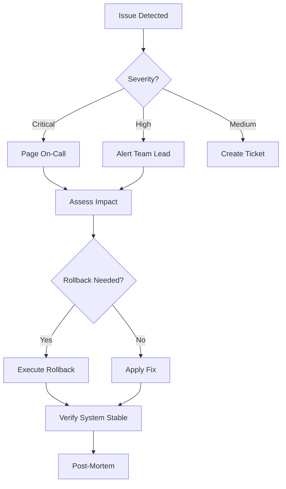

# CrewAI Migration Runbook

**Document Version**: 1.0
**Last Updated**: 2025-07-20
**Migration Window**: TBD (Target: Week 9 of migration plan)
**Runbook Owner**: Systems Design Agent
**Emergency Contact**: On-call rotation via PagerDuty

## Executive Summary

This runbook provides detailed procedures for migrating the Bulk Grillers Pride AI categorization system from LangChain to CrewAI. The migration introduces a multi-agent architecture with enhanced collaboration, memory persistence, and workflow orchestration capabilities.

**Critical Success Factors**:
- Zero downtime during migration
- Maintain 85%+ categorization accuracy
- Response time p95 < 8 seconds
- Successful rollback capability within 5 minutes

## Table of Contents

1. [Pre-Migration Checklist](#pre-migration-checklist)
2. [Migration Steps](#migration-steps)
3. [Validation Procedures](#validation-procedures)
4. [Rollback Plan](#rollback-plan)
5. [Troubleshooting Guides](#troubleshooting-guides)
6. [Communication Plan](#communication-plan)
7. [Emergency Procedures](#emergency-procedures)
8. [Monitoring Requirements](#monitoring-requirements)
9. [Success Criteria](#success-criteria)
10. [Post-Migration Tasks](#post-migration-tasks)

---

## 1. Pre-Migration Checklist

### T-7 Days: Initial Preparation

```bash
# 1. Verify all code is merged to main
git checkout main
git pull origin main
git log --oneline -n 10 | grep -E "(CrewAI|crewai|migration)"

# 2. Run full test suite
npm run test:all
npm run test:integration
npm run test:e2e

# 3. Backup production database
./scripts/backup-production.sh --full --verify

# 4. Verify feature flags are deployed
curl -X GET https://api.bulkgrillerspride.com/v1/feature-flags \
  -H "Authorization: Bearer $API_KEY" | jq '.flags.crewai_migration'
```

### T-3 Days: System Health Verification

```yaml
health_checks:
  - name: "API Response Time"
    command: "./scripts/health-check.sh --metric response-time"
    threshold: "< 500ms p95"
    
  - name: "Database Connection Pool"
    command: "psql -c 'SELECT count(*) FROM pg_stat_activity'"
    threshold: "< 80% capacity"
    
  - name: "Redis Memory Usage"
    command: "redis-cli INFO memory | grep used_memory_human"
    threshold: "< 70% allocated"
    
  - name: "LLM Provider Status"
    command: "./scripts/check-llm-providers.sh --all"
    threshold: "All providers operational"
```

### T-1 Day: Final Verification

```bash
#!/bin/bash
# pre-migration-verify.sh

echo "=== PRE-MIGRATION VERIFICATION ==="

# Check team availability
echo "1. Verifying team availability..."
./scripts/check-oncall.sh --date tomorrow --required 3

# Verify rollback scripts
echo "2. Testing rollback procedures..."
./scripts/test-rollback.sh --dry-run

# Check monitoring dashboards
echo "3. Verifying monitoring..."
for dashboard in "crewai-migration" "system-health" "llm-performance"; do
  curl -s "https://monitoring.bulkgrillerspride.com/api/dashboards/$dashboard/status"
done

# Verify backup integrity
echo "4. Validating backups..."
./scripts/verify-backup.sh --latest --checksum

# Test feature flag toggle
echo "5. Testing feature flags..."
./scripts/test-feature-flag.sh --flag crewai_migration --toggle
```

### Go/No-Go Decision Checkpoint #1

```yaml
decision_criteria:
  required:
    - all_tests_passing: true
    - backup_verified: true
    - team_available: >= 3
    - system_health: "green"
    - feature_flags_tested: true
  
  abort_if:
    - critical_bugs_open: > 0
    - performance_degradation: > 10%
    - team_availability: < 2
```

---

## 2. Migration Steps

### Phase 1: Enable CrewAI in Shadow Mode (T+0:00)

```bash
#!/bin/bash
# migration-phase1.sh

echo "=== PHASE 1: SHADOW MODE ==="
START_TIME=$(date +%s)

# 1. Enable shadow mode feature flag
echo "Enabling shadow mode..."
curl -X POST https://api.bulkgrillerspride.com/v1/feature-flags/crewai_migration \
  -H "Authorization: Bearer $ADMIN_KEY" \
  -H "Content-Type: application/json" \
  -d '{
    "enabled": true,
    "percentage": 0,
    "shadow_mode": true,
    "log_level": "debug"
  }'

# 2. Verify shadow mode is active
sleep 5
./scripts/verify-shadow-mode.sh --timeout 60

# 3. Monitor for 15 minutes
echo "Monitoring shadow mode performance..."
./scripts/monitor-migration.sh --phase shadow --duration 900

PHASE1_DURATION=$(($(date +%s) - START_TIME))
echo "Phase 1 completed in ${PHASE1_DURATION}s"
```

### Phase 2: Gradual Traffic Migration (T+0:15)

```bash
#!/bin/bash
# migration-phase2.sh

echo "=== PHASE 2: GRADUAL MIGRATION ==="

# Traffic percentages to migrate
PERCENTAGES=(1 5 10 25 50 75 90 100)

for PERCENTAGE in "${PERCENTAGES[@]}"; do
  echo "Migrating to ${PERCENTAGE}% CrewAI traffic..."
  
  # Update feature flag
  curl -X PATCH https://api.bulkgrillerspride.com/v1/feature-flags/crewai_migration \
    -H "Authorization: Bearer $ADMIN_KEY" \
    -H "Content-Type: application/json" \
    -d "{\"percentage\": $PERCENTAGE, \"shadow_mode\": false}"
  
  # Wait for propagation
  sleep 30
  
  # Run validation suite
  ./scripts/validate-migration.sh \
    --percentage $PERCENTAGE \
    --duration 300 \
    --abort-on-error
  
  # Check metrics
  METRICS=$(./scripts/get-migration-metrics.sh --last 5m)
  ERROR_RATE=$(echo $METRICS | jq -r '.error_rate')
  LATENCY_P95=$(echo $METRICS | jq -r '.latency_p95')
  
  # Abort if thresholds exceeded
  if (( $(echo "$ERROR_RATE > 0.05" | bc -l) )); then
    echo "ERROR: Error rate ${ERROR_RATE} exceeds 5% threshold"
    ./scripts/emergency-rollback.sh --immediate
    exit 1
  fi
  
  if (( $(echo "$LATENCY_P95 > 8000" | bc -l) )); then
    echo "ERROR: P95 latency ${LATENCY_P95}ms exceeds 8s threshold"
    ./scripts/emergency-rollback.sh --immediate
    exit 1
  fi
  
  echo "✓ ${PERCENTAGE}% migration successful"
  echo "  Error Rate: ${ERROR_RATE}"
  echo "  P95 Latency: ${LATENCY_P95}ms"
done
```

### Phase 3: Full Cutover (T+2:00)

```bash
#!/bin/bash
# migration-phase3.sh

echo "=== PHASE 3: FULL CUTOVER ==="

# 1. Disable LangChain fallback
curl -X POST https://api.bulkgrillerspride.com/v1/config/langchain \
  -H "Authorization: Bearer $ADMIN_KEY" \
  -H "Content-Type: application/json" \
  -d '{"fallback_enabled": false}'

# 2. Update service configuration
kubectl apply -f k8s/crewai-production.yaml
kubectl rollout status deployment/categorization-api

# 3. Clear caches to ensure fresh CrewAI processing
redis-cli FLUSHDB

# 4. Run comprehensive validation
./scripts/full-validation.sh --comprehensive --timeout 600
```

### Go/No-Go Decision Checkpoint #2

```python
#!/usr/bin/env python3
# go-no-go-decision.py

import sys
import json
import requests

def check_migration_status():
    """Automated go/no-go decision based on metrics"""
    
    metrics = {
        "error_rate": get_metric("error_rate", "5m"),
        "latency_p95": get_metric("latency_p95", "5m"),
        "accuracy": get_metric("categorization_accuracy", "5m"),
        "throughput": get_metric("throughput", "5m"),
        "cost_per_request": get_metric("cost_per_request", "5m")
    }
    
    decisions = []
    
    # Check each metric against thresholds
    if metrics["error_rate"] > 0.05:
        decisions.append(("NO-GO", f"Error rate {metrics['error_rate']:.2%} exceeds 5%"))
    
    if metrics["latency_p95"] > 8000:
        decisions.append(("NO-GO", f"P95 latency {metrics['latency_p95']}ms exceeds 8s"))
    
    if metrics["accuracy"] < 0.85:
        decisions.append(("NO-GO", f"Accuracy {metrics['accuracy']:.2%} below 85%"))
    
    if metrics["throughput"] < 500:
        decisions.append(("WARNING", f"Throughput {metrics['throughput']} below target"))
    
    if metrics["cost_per_request"] > 0.10:
        decisions.append(("WARNING", f"Cost ${metrics['cost_per_request']:.3f} exceeds budget"))
    
    # Make final decision
    no_go_count = sum(1 for d in decisions if d[0] == "NO-GO")
    
    if no_go_count > 0:
        print("🚫 MIGRATION DECISION: NO-GO")
        for decision, reason in decisions:
            print(f"  - {decision}: {reason}")
        return False
    else:
        print("✅ MIGRATION DECISION: GO")
        print(f"  All critical metrics within acceptable ranges")
        return True

if __name__ == "__main__":
    if not check_migration_status():
        sys.exit(1)
```

---

## 3. Validation Procedures

### Functional Validation

```python
#!/usr/bin/env python3
# functional-validation.py

import asyncio
import json
from datetime import datetime

async def validate_categorization():
    """Validate CrewAI categorization against test dataset"""
    
    test_cases = [
        {
            "product": {"name": "Weber Grill Cover", "description": "Heavy duty grill cover"},
            "expected_categories": ["Accessories", "Covers", "Protection"],
            "min_confidence": 0.7
        },
        {
            "product": {"name": "BBQ Sauce Set", "description": "Variety pack of BBQ sauces"},
            "expected_categories": ["Condiments", "Sauces", "Gift Sets"],
            "min_confidence": 0.8
        }
    ]
    
    results = []
    for test in test_cases:
        response = await categorize_product(test["product"])
        
        # Validate response structure
        assert "categories" in response
        assert "confidence" in response
        assert "agent_metrics" in response
        
        # Check category accuracy
        matched = len(set(response["categories"]) & set(test["expected_categories"]))
        accuracy = matched / len(test["expected_categories"])
        
        # Check confidence threshold
        confidence_met = response["confidence"] >= test["min_confidence"]
        
        results.append({
            "product": test["product"]["name"],
            "passed": accuracy >= 0.66 and confidence_met,
            "accuracy": accuracy,
            "confidence": response["confidence"]
        })
    
    return results

async def validate_performance():
    """Validate performance metrics"""
    
    # Run load test
    start_time = datetime.now()
    tasks = []
    
    for i in range(100):
        task = categorize_product({
            "name": f"Test Product {i}",
            "description": "Generic product for testing"
        })
        tasks.append(task)
    
    results = await asyncio.gather(*tasks)
    duration = (datetime.now() - start_time).total_seconds()
    
    metrics = {
        "total_requests": len(results),
        "successful_requests": sum(1 for r in results if r.get("success")),
        "avg_latency": sum(r.get("latency", 0) for r in results) / len(results),
        "throughput": len(results) / duration
    }
    
    return metrics
```

### Integration Testing

```bash
#!/bin/bash
# integration-validation.sh

echo "=== INTEGRATION VALIDATION ==="

# Test 1: Database Integration
echo "1. Testing database integration..."
psql -d production -c "
  SELECT COUNT(*) as pending_categorizations
  FROM products
  WHERE category_id IS NULL
  AND created_at > NOW() - INTERVAL '1 hour'
"

# Test 2: Cache Integration
echo "2. Testing Redis cache..."
redis-cli --scan --pattern "crewai:*" | head -10

# Test 3: LLM Provider Integration
echo "3. Testing LLM providers..."
for provider in openai anthropic gemini; do
  curl -X POST https://api.bulkgrillerspride.com/v1/test/llm \
    -H "Content-Type: application/json" \
    -d "{\"provider\": \"$provider\", \"test_mode\": true}"
done

# Test 4: Monitoring Integration
echo "4. Testing monitoring..."
curl -s https://monitoring.bulkgrillerspride.com/api/metrics/crewai | jq
```

---

## 4. Rollback Plan

### Immediate Rollback (< 5 minutes)

```bash
#!/bin/bash
# emergency-rollback.sh

echo "🚨 INITIATING EMERGENCY ROLLBACK 🚨"
ROLLBACK_START=$(date +%s)

# 1. Revert feature flag immediately
curl -X POST https://api.bulkgrillerspride.com/v1/feature-flags/crewai_migration \
  -H "Authorization: Bearer $ADMIN_KEY" \
  -H "Content-Type: application/json" \
  -d '{"enabled": false, "percentage": 0}'

# 2. Enable LangChain fallback
curl -X POST https://api.bulkgrillerspride.com/v1/config/langchain \
  -H "Authorization: Bearer $ADMIN_KEY" \
  -H "Content-Type: application/json" \
  -d '{"fallback_enabled": true, "priority": "high"}'

# 3. Clear CrewAI caches
redis-cli --scan --pattern "crewai:*" | xargs redis-cli DEL

# 4. Restart services
kubectl rollout restart deployment/categorization-api
kubectl rollout status deployment/categorization-api --timeout=300s

# 5. Verify rollback
sleep 30
./scripts/verify-langchain-active.sh

ROLLBACK_DURATION=$(($(date +%s) - ROLLBACK_START))
echo "✓ Rollback completed in ${ROLLBACK_DURATION} seconds"

# 6. Send notifications
./scripts/notify-rollback.sh \
  --channel "#incident-response" \
  --severity "high" \
  --duration "$ROLLBACK_DURATION"
```

### Rollback Decision Criteria

```yaml
immediate_rollback_triggers:
  - error_rate: "> 10%"
  - latency_p99: "> 15 seconds"
  - accuracy_drop: "> 20%"
  - memory_leak: "detected"
  - agent_deadlock: "confirmed"

graceful_rollback_triggers:
  - error_rate: "5-10%"
  - latency_p95: "8-12 seconds"
  - accuracy: "< 80%"
  - cost_increase: "> 50%"
```

### Data Preservation

```python
#!/usr/bin/env python3
# preserve-migration-data.py

import json
import boto3
from datetime import datetime

def preserve_migration_state():
    """Preserve CrewAI state before rollback"""
    
    timestamp = datetime.now().isoformat()
    
    # 1. Export Redis state
    redis_data = export_redis_state("crewai:*")
    
    # 2. Export agent memories
    memories = export_agent_memories()
    
    # 3. Export metrics
    metrics = export_migration_metrics()
    
    # 4. Create rollback package
    rollback_data = {
        "timestamp": timestamp,
        "redis_state": redis_data,
        "agent_memories": memories,
        "metrics": metrics,
        "configuration": get_current_config()
    }
    
    # 5. Upload to S3
    s3 = boto3.client('s3')
    key = f"rollbacks/crewai/{timestamp}/state.json"
    s3.put_object(
        Bucket='bulkgrillerspride-backups',
        Key=key,
        Body=json.dumps(rollback_data)
    )
    
    print(f"✓ Migration state preserved: s3://bulkgrillerspride-backups/{key}")
    return key
```

---

## 5. Troubleshooting Guides

### Common Issues and Solutions

#### Issue 1: Agent Communication Timeout

```bash
# Symptoms: Logs show "Agent communication timeout after 30s"
# Solution:
kubectl logs -n production deployment/categorization-api | grep -E "timeout|deadlock"

# Fix 1: Increase agent timeout
kubectl set env deployment/categorization-api CREWAI_AGENT_TIMEOUT=60

# Fix 2: Check Redis connectivity
redis-cli ping
redis-cli --latency

# Fix 3: Reset agent state
./scripts/reset-agent-state.sh --force
```

#### Issue 2: Memory Leak in Shared Memory System

```python
#!/usr/bin/env python3
# diagnose-memory-leak.py

import psutil
import time

def diagnose_memory_leak():
    """Diagnose and fix memory leaks"""
    
    # Get current memory usage
    process = psutil.Process()
    initial_memory = process.memory_info().rss / 1024 / 1024  # MB
    
    # Monitor for 5 minutes
    samples = []
    for i in range(30):
        time.sleep(10)
        current_memory = process.memory_info().rss / 1024 / 1024
        samples.append(current_memory)
        
        # Check for rapid growth
        if len(samples) > 5:
            growth_rate = (samples[-1] - samples[-5]) / 5
            if growth_rate > 10:  # 10MB/sample = 60MB/min
                print(f"⚠️  Memory leak detected: {growth_rate:.2f}MB/10s")
                
                # Emergency fix
                import gc
                gc.collect()
                
                # Clear crew caches
                clear_crew_caches()
                
                # Restart if necessary
                if current_memory > initial_memory * 2:
                    print("🚨 Restarting service due to memory leak")
                    os.system("supervisorctl restart categorization-worker")
```

#### Issue 3: LLM Provider Failures

```bash
#!/bin/bash
# fix-llm-failures.sh

# Diagnose which provider is failing
for provider in openai anthropic gemini; do
  echo "Testing $provider..."
  response=$(curl -s -w "\n%{http_code}" \
    -X POST "https://api.bulkgrillerspride.com/v1/test/llm/$provider")
  
  http_code=$(echo "$response" | tail -n1)
  
  if [ "$http_code" != "200" ]; then
    echo "⚠️  $provider failing with code $http_code"
    
    # Provider-specific fixes
    case $provider in
      openai)
        # Check API key
        ./scripts/validate-api-key.sh --provider openai
        # Switch to fallback model
        kubectl set env deployment/categorization-api OPENAI_MODEL=gpt-3.5-turbo
        ;;
      anthropic)
        # Check rate limits
        ./scripts/check-rate-limits.sh --provider anthropic
        # Enable retry with backoff
        kubectl set env deployment/categorization-api ANTHROPIC_RETRY_ENABLED=true
        ;;
      gemini)
        # Check quota
        ./scripts/check-quota.sh --provider gemini
        # Switch region if needed
        kubectl set env deployment/categorization-api GEMINI_REGION=us-central1
        ;;
    esac
  fi
done
```

### Debug Commands Cheatsheet

```bash
# View CrewAI agent logs
kubectl logs -f deployment/categorization-api -c crewai-agent

# Check agent memory state
redis-cli HGETALL "crewai:agent:memory:analyzer"

# Monitor agent communication
tcpdump -i any -w crewai.pcap 'port 6379'

# Profile CPU usage
py-spy top --pid $(pgrep -f crewai)

# Check task queue depth
redis-cli LLEN "crewai:tasks:pending"

# View error traces
kubectl exec -it deployment/categorization-api -- python -m crewai.debug

# Export agent state for debugging
./scripts/export-agent-state.sh --output /tmp/agent-state.json
```

---

## 6. Communication Plan

### T-7 Days: Initial Announcement

```markdown
Subject: Upcoming AI Categorization System Upgrade - Action Required

Team,

We will be upgrading our AI categorization system to CrewAI on [DATE]. This upgrade will improve accuracy and performance.

**What's Changing:**
- New multi-agent architecture for better categorization
- Enhanced memory and learning capabilities
- Improved error handling and recovery

**Action Required:**
- Review the migration timeline below
- Ensure you're available during the migration window
- Complete any pending categorization reviews by [DATE]

**Timeline:**
- T-7 days: This announcement
- T-3 days: System testing begins
- T-1 day: Final preparations
- T+0: Migration begins (2-3 hour window)
- T+1 day: Post-migration review

Contact: [Your Name] for questions
```

### T-1 Day: Final Reminder

```markdown
Subject: REMINDER: AI System Migration Tomorrow

Tomorrow's migration schedule:
- 10:00 AM PST: Migration begins
- 10:15 AM PST: Shadow mode testing
- 11:00 AM PST: Gradual traffic migration
- 12:00 PM PST: Full cutover
- 1:00 PM PST: Migration complete

During this time:
- The system will remain available
- You may notice slight delays (< 1 second)
- All categorizations will be queued if needed

Slack Channel: #crewai-migration
Status Page: https://status.bulkgrillerspride.com
```

### During Migration Updates

```python
#!/usr/bin/env python3
# migration-updates.py

import slack
import time

def send_migration_update(phase, status, metrics=None):
    """Send real-time migration updates"""
    
    client = slack.WebClient(token=SLACK_TOKEN)
    
    message = {
        "channel": "#crewai-migration",
        "blocks": [
            {
                "type": "header",
                "text": {
                    "type": "plain_text",
                    "text": f"Migration Update: {phase}"
                }
            },
            {
                "type": "section",
                "fields": [
                    {
                        "type": "mrkdwn",
                        "text": f"*Status:* {status}"
                    },
                    {
                        "type": "mrkdwn",
                        "text": f"*Time:* {time.strftime('%H:%M:%S PST')}"
                    }
                ]
            }
        ]
    }
    
    if metrics:
        message["blocks"].append({
            "type": "section",
            "text": {
                "type": "mrkdwn",
                "text": f"```\n{format_metrics(metrics)}\n```"
            }
        })
    
    client.chat_postMessage(**message)
```

---

## 7. Emergency Procedures

### Incident Response Flowchart



### Critical Issue Resolution

```bash
#!/bin/bash
# handle-critical-issue.sh

handle_critical_issue() {
    local issue_type=$1
    
    case $issue_type in
        "complete_failure")
            echo "🚨 CRITICAL: Complete system failure detected"
            # 1. Immediate rollback
            ./scripts/emergency-rollback.sh --immediate --skip-validation
            
            # 2. Page on-call
            ./scripts/page-oncall.sh --severity critical --message "CrewAI migration failed"
            
            # 3. Switch to maintenance mode
            kubectl apply -f k8s/maintenance-mode.yaml
            ;;
            
        "data_corruption")
            echo "🚨 CRITICAL: Data corruption detected"
            # 1. Stop all writes
            kubectl scale deployment/categorization-api --replicas=0
            
            # 2. Backup current state
            ./scripts/emergency-backup.sh --immediate
            
            # 3. Restore from last known good
            ./scripts/restore-database.sh --timestamp "$LAST_GOOD_TIMESTAMP"
            ;;
            
        "security_breach")
            echo "🚨 CRITICAL: Security breach detected"
            # 1. Revoke all API keys
            ./scripts/revoke-api-keys.sh --all --immediate
            
            # 2. Enable emergency firewall rules
            ./scripts/enable-lockdown.sh
            
            # 3. Notify security team
            ./scripts/notify-security.sh --priority critical
            ;;
    esac
}
```

### Escalation Matrix

```yaml
escalation_levels:
  L1_Engineer:
    response_time: "< 5 minutes"
    handles:
      - performance_degradation
      - single_agent_failure
      - cache_issues
    
  L2_Lead:
    response_time: "< 15 minutes"
    handles:
      - multiple_agent_failures
      - rollback_decisions
      - data_inconsistencies
    
  L3_Architect:
    response_time: "< 30 minutes"
    handles:
      - complete_system_failure
      - data_corruption
      - security_incidents
    
  Executive:
    response_time: "< 1 hour"
    handles:
      - customer_impact
      - financial_impact
      - regulatory_issues
```

---

## 8. Monitoring Requirements

### Key Metrics Dashboard

```python
#!/usr/bin/env python3
# monitoring-setup.py

PROMETHEUS_METRICS = {
    # Application Metrics
    "crewai_categorization_requests_total": {
        "type": "counter",
        "labels": ["status", "provider", "agent"],
        "alert_rule": "rate(crewai_categorization_requests_total[5m]) < 10"
    },
    
    "crewai_categorization_duration_seconds": {
        "type": "histogram",
        "labels": ["provider", "agent"],
        "alert_rule": "histogram_quantile(0.95, crewai_categorization_duration_seconds) > 8"
    },
    
    "crewai_agent_memory_bytes": {
        "type": "gauge",
        "labels": ["agent_role"],
        "alert_rule": "crewai_agent_memory_bytes > 536870912"  # 512MB
    },
    
    # Business Metrics
    "crewai_categorization_accuracy": {
        "type": "gauge",
        "labels": ["category_type"],
        "alert_rule": "crewai_categorization_accuracy < 0.85"
    },
    
    "crewai_cost_per_request_dollars": {
        "type": "gauge",
        "labels": ["provider"],
        "alert_rule": "crewai_cost_per_request_dollars > 0.10"
    }
}

def create_grafana_dashboard():
    """Create Grafana dashboard for migration monitoring"""
    
    dashboard = {
        "dashboard": {
            "title": "CrewAI Migration Monitor",
            "panels": [
                {
                    "title": "Request Rate",
                    "targets": [{
                        "expr": "rate(crewai_categorization_requests_total[5m])"
                    }]
                },
                {
                    "title": "Response Time (p95)",
                    "targets": [{
                        "expr": "histogram_quantile(0.95, crewai_categorization_duration_seconds)"
                    }]
                },
                {
                    "title": "Accuracy Trend",
                    "targets": [{
                        "expr": "crewai_categorization_accuracy"
                    }]
                },
                {
                    "title": "Cost per Request",
                    "targets": [{
                        "expr": "crewai_cost_per_request_dollars"
                    }]
                }
            ]
        }
    }
    
    return dashboard
```

### Alerting Configuration

```yaml
# alerts.yaml
groups:
  - name: crewai_migration
    interval: 30s
    rules:
      - alert: HighErrorRate
        expr: |
          rate(crewai_categorization_requests_total{status="error"}[5m]) 
          / rate(crewai_categorization_requests_total[5m]) > 0.05
        for: 2m
        labels:
          severity: critical
          team: backend
        annotations:
          summary: "High error rate in CrewAI categorization"
          description: "Error rate is {{ $value | humanizePercentage }}"
          
      - alert: SlowResponseTime
        expr: |
          histogram_quantile(0.95, rate(crewai_categorization_duration_seconds_bucket[5m])) > 8
        for: 5m
        labels:
          severity: warning
          team: backend
        annotations:
          summary: "Slow CrewAI response times"
          description: "P95 latency is {{ $value }}s"
          
      - alert: LowAccuracy
        expr: crewai_categorization_accuracy < 0.85
        for: 10m
        labels:
          severity: critical
          team: ml
        annotations:
          summary: "CrewAI accuracy below threshold"
          description: "Accuracy is {{ $value | humanizePercentage }}"
          
      - alert: HighCost
        expr: crewai_cost_per_request_dollars > 0.10
        for: 15m
        labels:
          severity: warning
          team: finance
        annotations:
          summary: "High cost per CrewAI request"
          description: "Cost per request is ${{ $value }}"
```

### Real-time Monitoring Script

```bash
#!/bin/bash
# realtime-monitor.sh

monitor_migration() {
    while true; do
        clear
        echo "=== CrewAI Migration Monitor ==="
        echo "Time: $(date)"
        echo
        
        # Get current metrics
        METRICS=$(curl -s http://localhost:9090/api/v1/query_range \
          -d 'query=crewai_categorization_requests_total' \
          -d 'start='$(date -u -d '5 minutes ago' +%s) \
          -d 'end='$(date +%s) \
          -d 'step=30s')
        
        # Display key metrics
        echo "📊 Request Rate: $(calculate_rate "$METRICS") req/s"
        echo "⏱️  P95 Latency: $(get_p95_latency)ms"
        echo "✅ Success Rate: $(get_success_rate)%"
        echo "🎯 Accuracy: $(get_accuracy)%"
        echo "💰 Cost/Request: $$(get_cost_per_request)"
        echo
        
        # Show agent status
        echo "=== Agent Status ==="
        for agent in analyzer matcher validator; do
            status=$(get_agent_status $agent)
            echo "$agent: $status"
        done
        
        sleep 5
    done
}
```

---

## 9. Success Criteria

### Quantitative Metrics

```yaml
success_metrics:
  performance:
    response_time_p50: "< 3 seconds"
    response_time_p95: "< 8 seconds"
    response_time_p99: "< 15 seconds"
    throughput: "> 500 products/minute"
    
  quality:
    categorization_accuracy: "> 85%"
    confidence_threshold: "> 0.7"
    validation_pass_rate: "> 95%"
    false_positive_rate: "< 5%"
    
  reliability:
    error_rate: "< 1%"
    availability: "> 99.9%"
    successful_retries: "> 95%"
    
  efficiency:
    cost_per_categorization: "< $0.10"
    agent_utilization: "> 70%"
    cache_hit_rate: "> 60%"
    
  scale:
    concurrent_crews: ">= 10"
    memory_per_crew: "< 512MB"
    initialization_time: "< 2 seconds"
```

### Qualitative Criteria

```python
#!/usr/bin/env python3
# validate-success-criteria.py

def validate_migration_success():
    """Comprehensive validation of migration success"""
    
    results = {
        "quantitative": validate_quantitative_metrics(),
        "qualitative": validate_qualitative_criteria(),
        "user_acceptance": validate_user_acceptance(),
        "technical_debt": assess_technical_debt()
    }
    
    # Generate success report
    report = generate_success_report(results)
    
    # Determine overall success
    success_score = calculate_success_score(results)
    
    if success_score >= 0.95:
        print("🎉 Migration FULLY SUCCESSFUL")
    elif success_score >= 0.85:
        print("✅ Migration SUCCESSFUL with minor issues")
    elif success_score >= 0.70:
        print("⚠️  Migration PARTIALLY SUCCESSFUL - remediation needed")
    else:
        print("❌ Migration FAILED - rollback recommended")
    
    return success_score, report
```

---

## 10. Post-Migration Tasks

### Immediate Tasks (T+1 Hour)

```bash
#!/bin/bash
# post-migration-immediate.sh

echo "=== POST-MIGRATION IMMEDIATE TASKS ==="

# 1. Disable debug logging
kubectl set env deployment/categorization-api LOG_LEVEL=info

# 2. Scale down shadow mode resources
kubectl scale deployment/langchain-shadow --replicas=0

# 3. Clear migration flags
redis-cli DEL "migration:*"

# 4. Update documentation
./scripts/update-docs.sh --component crewai --version 1.0

# 5. Send success notification
./scripts/notify-success.sh \
  --channel "#general" \
  --metrics "$(get_migration_metrics)"
```

### Week 1 Tasks

```yaml
optimization_tasks:
  - task: "Tune agent memory settings"
    owner: "backend-team"
    deadline: "T+3 days"
    script: "./scripts/optimize-agent-memory.sh"
    
  - task: "Optimize CrewAI caching"
    owner: "performance-team"
    deadline: "T+5 days"
    script: "./scripts/optimize-caching.sh"
    
  - task: "Review and adjust alert thresholds"
    owner: "sre-team"
    deadline: "T+7 days"
    script: "./scripts/adjust-alert-thresholds.sh"

cleanup_tasks:
  - task: "Remove LangChain dependencies"
    owner: "backend-team"
    deadline: "T+14 days"
    validation: "npm ls | grep -v langchain"
    
  - task: "Archive migration artifacts"
    owner: "devops-team"
    deadline: "T+7 days"
    location: "s3://bulkgrillerspride-archives/migrations/crewai/"
    
  - task: "Decommission shadow mode infrastructure"
    owner: "infra-team"
    deadline: "T+10 days"
    resources: ["k8s/langchain-shadow.yaml", "redis-shadow"]
```

### Documentation Updates

```bash
#!/bin/bash
# update-documentation.sh

# 1. Update API documentation
swagger-codegen generate \
  -i api/crewai-categorization.yaml \
  -o docs/api/

# 2. Update runbooks
cp docs/specs/crewai-migration-runbook.md docs/runbooks/crewai-operations.md
sed -i 's/migration/operations/g' docs/runbooks/crewai-operations.md

# 3. Update architecture diagrams
python scripts/generate-architecture-diagram.py \
  --input architecture/crewai.yaml \
  --output docs/diagrams/crewai-architecture.png

# 4. Create troubleshooting guide
cat > docs/troubleshooting/crewai.md << EOF
# CrewAI Troubleshooting Guide

## Common Issues

### Agent Communication Timeouts
- Check Redis connectivity
- Verify network policies
- Review agent logs

### Memory Leaks
- Monitor agent memory usage
- Check for circular references
- Review caching strategy

### Performance Degradation
- Check LLM provider status
- Review batch sizes
- Optimize prompt templates
EOF

# 5. Update team wiki
./scripts/update-wiki.sh --page "AI-Categorization" --content docs/
```

### Performance Optimization

```python
#!/usr/bin/env python3
# optimize-crewai-performance.py

import asyncio
from datetime import datetime, timedelta

async def optimize_performance():
    """Post-migration performance optimization"""
    
    optimizations = []
    
    # 1. Analyze agent performance
    agent_metrics = await analyze_agent_performance()
    for agent, metrics in agent_metrics.items():
        if metrics['avg_duration'] > 2000:  # 2 seconds
            optimization = await optimize_agent(agent)
            optimizations.append(optimization)
    
    # 2. Optimize memory usage
    memory_stats = await get_memory_statistics()
    if memory_stats['avg_usage'] > 400 * 1024 * 1024:  # 400MB
        memory_opt = await optimize_memory_usage()
        optimizations.append(memory_opt)
    
    # 3. Tune caching strategy
    cache_stats = await get_cache_statistics()
    if cache_stats['hit_rate'] < 0.6:  # 60%
        cache_opt = await optimize_caching()
        optimizations.append(cache_opt)
    
    # 4. Adjust batch sizes
    throughput = await measure_throughput()
    if throughput < 600:  # products/minute
        batch_opt = await optimize_batch_size()
        optimizations.append(batch_opt)
    
    return optimizations

async def continuous_optimization():
    """Run continuous optimization loop"""
    
    while True:
        try:
            # Run optimization
            optimizations = await optimize_performance()
            
            # Apply optimizations
            for opt in optimizations:
                await apply_optimization(opt)
            
            # Wait before next run
            await asyncio.sleep(3600)  # 1 hour
            
        except Exception as e:
            logger.error(f"Optimization failed: {e}")
            await asyncio.sleep(300)  # 5 minutes retry
```

---

## Appendix A: Validation Scripts

### Pre-Migration Validation

```python
#!/usr/bin/env python3
# pre-migration-validation.py

import sys
import json
from datetime import datetime

def validate_prerequisites():
    """Validate all prerequisites are met"""
    
    checks = {
        "code_deployed": check_deployment_status(),
        "tests_passing": check_test_results(),
        "feature_flags": check_feature_flags(),
        "backups_valid": check_backup_validity(),
        "team_available": check_team_availability(),
        "dependencies_ready": check_dependencies(),
        "monitoring_ready": check_monitoring_setup(),
        "rollback_tested": check_rollback_procedure()
    }
    
    failed_checks = [k for k, v in checks.items() if not v]
    
    if failed_checks:
        print(f"❌ Prerequisites not met: {', '.join(failed_checks)}")
        return False
    
    print("✅ All prerequisites validated")
    return True

def check_deployment_status():
    """Verify CrewAI code is deployed"""
    # Implementation
    pass

def check_test_results():
    """Verify all tests are passing"""
    # Implementation
    pass
```

### Load Testing Script

```python
#!/usr/bin/env python3
# load-test-crewai.py

import asyncio
import aiohttp
import time
from concurrent.futures import ThreadPoolExecutor

async def load_test(duration_minutes=10, requests_per_second=50):
    """Run load test against CrewAI endpoint"""
    
    url = "https://api.bulkgrillerspride.com/v1/categorize"
    headers = {"Authorization": f"Bearer {API_KEY}"}
    
    products = generate_test_products(1000)
    
    start_time = time.time()
    end_time = start_time + (duration_minutes * 60)
    
    results = []
    request_count = 0
    
    async with aiohttp.ClientSession() as session:
        while time.time() < end_time:
            # Send batch of requests
            tasks = []
            for _ in range(requests_per_second):
                product = random.choice(products)
                task = send_request(session, url, headers, product)
                tasks.append(task)
            
            # Wait for all requests to complete
            responses = await asyncio.gather(*tasks, return_exceptions=True)
            
            # Collect results
            for response in responses:
                if isinstance(response, Exception):
                    results.append({"success": False, "error": str(response)})
                else:
                    results.append(response)
            
            request_count += len(tasks)
            
            # Wait to maintain request rate
            elapsed = time.time() - start_time
            expected_requests = elapsed * requests_per_second
            if request_count > expected_requests:
                await asyncio.sleep(1)
    
    # Generate report
    generate_load_test_report(results, duration_minutes)
```

---

## Appendix B: Emergency Contacts

```yaml
emergency_contacts:
  on_call_primary:
    name: "On-Call Engineer"
    phone: "+1-555-0100"
    slack: "@oncall"
    
  on_call_secondary:
    name: "Backup On-Call"
    phone: "+1-555-0101"
    slack: "@backup-oncall"
    
  team_lead:
    name: "Engineering Lead"
    phone: "+1-555-0102"
    slack: "@eng-lead"
    email: "eng-lead@bulkgrillerspride.com"
    
  architect:
    name: "System Architect"
    phone: "+1-555-0103"
    slack: "@architect"
    
  vendor_support:
    openai:
      email: "support@openai.com"
      priority: "enterprise"
    anthropic:
      email: "support@anthropic.com"
      account_id: "BGP-12345"
    google:
      email: "cloud-support@google.com"
      project_id: "bulkgrillerspride-prod"
```

---

## Appendix C: Rollback Verification

```bash
#!/bin/bash
# verify-rollback-complete.sh

echo "=== ROLLBACK VERIFICATION ==="

# 1. Verify LangChain is active
ACTIVE_SYSTEM=$(curl -s https://api.bulkgrillerspride.com/v1/health | jq -r '.categorization_system')
if [ "$ACTIVE_SYSTEM" != "langchain" ]; then
    echo "❌ FAIL: System is still using $ACTIVE_SYSTEM"
    exit 1
fi

# 2. Verify CrewAI is disabled
CREWAI_ENABLED=$(curl -s https://api.bulkgrillerspride.com/v1/feature-flags/crewai_migration | jq -r '.enabled')
if [ "$CREWAI_ENABLED" != "false" ]; then
    echo "❌ FAIL: CrewAI is still enabled"
    exit 1
fi

# 3. Verify metrics are normal
ERROR_RATE=$(get_metric "error_rate" "5m")
if (( $(echo "$ERROR_RATE > 0.02" | bc -l) )); then
    echo "❌ FAIL: Error rate still elevated at ${ERROR_RATE}"
    exit 1
fi

# 4. Verify no CrewAI processes
CREWAI_PROCS=$(ps aux | grep -c "[c]rewai")
if [ "$CREWAI_PROCS" -gt 0 ]; then
    echo "⚠️  WARNING: Found $CREWAI_PROCS CrewAI processes still running"
fi

echo "✅ Rollback verification complete"
echo "  System: LangChain"
echo "  Error Rate: ${ERROR_RATE}%"
echo "  Status: Operational"
```

---

## Document Revision History

| Version | Date | Author | Changes |
|---------|------|--------|---------|
| 1.0 | 2025-07-20 | Systems Design Agent | Initial release |
| | | | |

---

**END OF RUNBOOK**

*This document should be reviewed and updated after each migration attempt or major system change.*