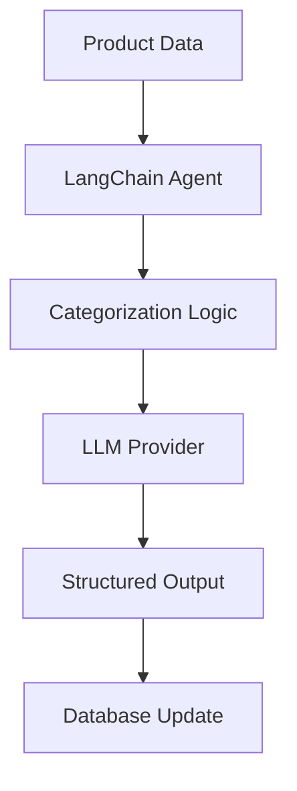
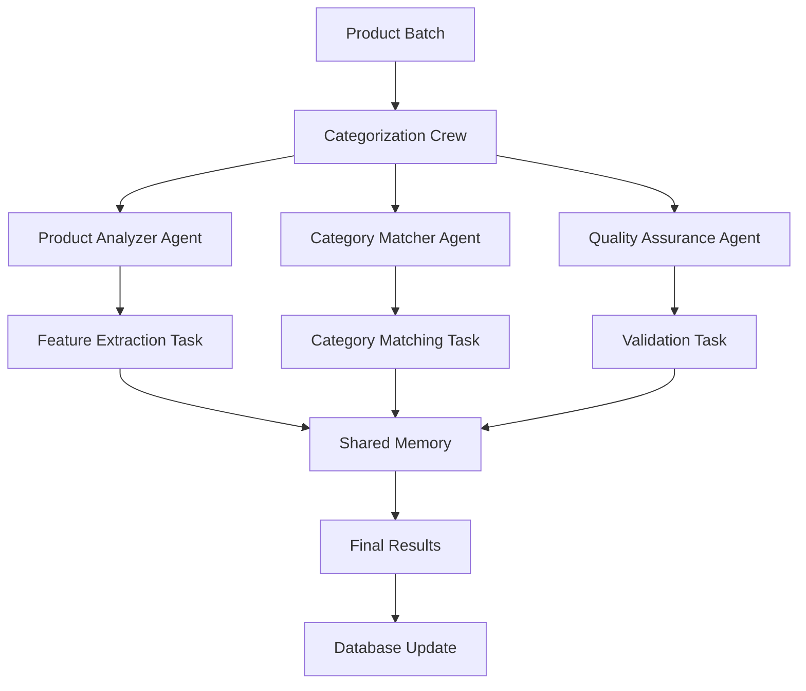
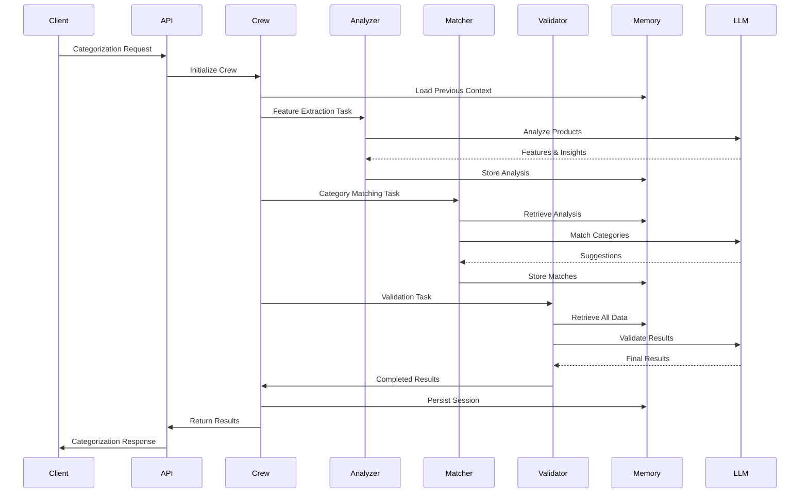

# LangChain to CrewAI Migration Architecture

## Executive Summary

This document outlines the comprehensive migration plan from LangChain/Langflow to CrewAI for the Bulk Grillers Pride AI categorization system. The migration will transform the current single-agent LangChain implementation into a multi-agent CrewAI system with enhanced collaboration, memory persistence, and workflow orchestration capabilities.

## System Architecture

### Current State (LangChain)



**Current Implementation:**
- Single LangChain agent performing product categorization
- Support for multiple LLM providers (OpenAI, Anthropic, Gemini)
- Structured output parsing with Zod schemas
- Batch processing with retry logic
- In-memory caching for similar products

### Target State (CrewAI)



**Target Implementation:**
- Multi-agent crew with specialized roles
- Shared memory and collaboration between agents
- Task-based workflow orchestration
- Enhanced error handling and recovery
- Persistent memory across categorization sessions

## Data Model Specifications

### Agent Definitions

```typescript
interface CategorizationAgent {
  role: 'analyzer' | 'matcher' | 'validator';
  goal: string;
  backstory: string;
  tools: Tool[];
  llm?: LLMConfig;
  memory?: boolean;
  verbose?: boolean;
  max_iter?: number;
}

interface CategorizationTask {
  description: string;
  expected_output: string;
  agent: CategorizationAgent;
  tools?: Tool[];
  context?: Task[];
  output_file?: string;
}

interface CategorizationCrew {
  agents: CategorizationAgent[];
  tasks: CategorizationTask[];
  process: 'sequential' | 'hierarchical';
  memory: boolean;
  cache: boolean;
  max_rpm?: number;
  share_crew?: boolean;
}
```

### Migration Data Structures

```typescript
interface MigrationState {
  phase: 'planning' | 'implementation' | 'testing' | 'cutover' | 'complete';
  startedAt: Date;
  currentProgress: number;
  blockers: string[];
  rollbackPoint?: string;
}

interface FeatureParityChecklist {
  multiProviderSupport: boolean;
  batchProcessing: boolean;
  retryLogic: boolean;
  structuredOutput: boolean;
  costEstimation: boolean;
  caching: boolean;
  errorHandling: boolean;
}
```

## API Contracts

### CrewAI Categorization Service

```typescript
interface CrewAICategorizationRequest {
  products: Product[];
  categories: Category[];
  customPrompt?: string;
  provider: 'openai' | 'anthropic' | 'gemini';
  model: string;
  options?: {
    maxRetries?: number;
    temperature?: number;
    enableMemory?: boolean;
    enableCache?: boolean;
  };
}

interface CrewAICategorizationResponse {
  results: ProductCategorizationResult[];
  metadata: {
    duration: number;
    tokensUsed: number;
    cost: CostEstimate;
    agentMetrics: AgentPerformance[];
  };
}

interface AgentPerformance {
  agentRole: string;
  tasksCompleted: number;
  avgExecutionTime: number;
  errors: number;
}
```

### Backwards Compatibility Layer

```typescript
// Adapter to maintain existing API contract during migration
class LangChainToCrewAIAdapter {
  async processBatchWithLangChain(
    products: Product[],
    categories: Category[],
    customPrompt: string,
    provider: AIProvider,
    apiKey: string,
    model: string,
    options?: ProcessingOptions
  ): Promise<BatchCategorizationResult> {
    // Transform to CrewAI request
    const crewRequest = this.transformToCrewAIRequest(/*...*/);
    
    // Execute CrewAI workflow
    const crewResponse = await this.crewService.categorize(crewRequest);
    
    // Transform back to expected format
    return this.transformToLangChainResponse(crewResponse);
  }
}
```

## Sequence Diagrams

### Product Categorization Flow



## Technical Analysis

### Performance Requirements

```yaml
response_time:
  p50: < 3 seconds
  p95: < 8 seconds
  p99: < 15 seconds

throughput:
  minimum: 100 products/minute
  target: 500 products/minute
  peak: 1000 products/minute

accuracy:
  category_match: > 85%
  confidence_threshold: > 0.7
  validation_pass_rate: > 95%

resource_usage:
  memory: < 512MB per crew
  cpu: < 2 cores per crew
  concurrent_crews: 10
```

### Scalability Considerations

1. **Horizontal Scaling**
   - Multiple crew instances for parallel processing
   - Load balancing across crew instances
   - Shared memory via Redis/Memcached

2. **Vertical Scaling**
   - Agent concurrency within crews
   - Batch size optimization
   - Memory pool management

3. **Caching Strategy**
   - Product similarity caching
   - Category hierarchy caching
   - LLM response caching
   - Memory state caching

### Security Threat Model

```yaml
threats:
  - type: API Key Exposure
    mitigation: Environment variables, key rotation
  
  - type: Prompt Injection
    mitigation: Input validation, output sanitization
  
  - type: Data Leakage
    mitigation: Memory encryption, session isolation
  
  - type: DoS via Large Batches
    mitigation: Rate limiting, batch size limits
  
  - type: Unauthorized Access
    mitigation: Authentication, authorization checks
```

### Edge Cases and Failure Modes

1. **Agent Communication Failures**
   - Fallback to single-agent mode
   - Retry with exponential backoff
   - Circuit breaker pattern

2. **Memory Corruption**
   - Checksums for memory integrity
   - Automatic memory rebuild
   - Graceful degradation

3. **LLM Provider Failures**
   - Multi-provider fallback
   - Cached response usage
   - Manual categorization queue

4. **Partial Batch Failures**
   - Individual product retry
   - Failed product isolation
   - Success/failure reporting

## Implementation Plan

### Phase 1: Foundation (Week 1-2)

```yaml
tasks:
  - id: T1
    description: "Set up CrewAI development environment"
    effort: "4 hours"
    dependencies: []
    assigned_to: backend-agent
  
  - id: T2
    description: "Create agent definitions and roles"
    effort: "6 hours"
    dependencies: [T1]
    assigned_to: backend-agent
  
  - id: T3
    description: "Implement basic crew structure"
    effort: "8 hours"
    dependencies: [T2]
    assigned_to: backend-agent
  
  - id: T4
    description: "Create backwards compatibility adapter"
    effort: "6 hours"
    dependencies: [T3]
    assigned_to: backend-agent
```

### Phase 2: Core Migration (Week 3-4)

```yaml
tasks:
  - id: T5
    description: "Migrate product analysis logic to analyzer agent"
    effort: "8 hours"
    dependencies: [T4]
    assigned_to: backend-agent
  
  - id: T6
    description: "Implement category matching agent"
    effort: "8 hours"
    dependencies: [T5]
    assigned_to: backend-agent
  
  - id: T7
    description: "Create validation agent with quality checks"
    effort: "6 hours"
    dependencies: [T6]
    assigned_to: backend-agent
  
  - id: T8
    description: "Implement shared memory system"
    effort: "10 hours"
    dependencies: [T5, T6, T7]
    assigned_to: backend-agent
```

### Phase 3: Feature Parity (Week 5-6)

```yaml
tasks:
  - id: T9
    description: "Implement multi-provider support in CrewAI"
    effort: "6 hours"
    dependencies: [T8]
    assigned_to: backend-agent
  
  - id: T10
    description: "Add retry logic and error handling"
    effort: "8 hours"
    dependencies: [T8]
    assigned_to: backend-agent
  
  - id: T11
    description: "Implement caching system"
    effort: "6 hours"
    dependencies: [T8]
    assigned_to: backend-agent
  
  - id: T12
    description: "Add cost estimation and tracking"
    effort: "4 hours"
    dependencies: [T9]
    assigned_to: backend-agent
```

### Phase 4: Testing & Validation (Week 7-8)

```yaml
tasks:
  - id: T13
    description: "Create comprehensive test suite"
    effort: "12 hours"
    dependencies: [T12]
    assigned_to: quality-agent
  
  - id: T14
    description: "Performance benchmarking"
    effort: "8 hours"
    dependencies: [T13]
    assigned_to: performance-agent
  
  - id: T15
    description: "A/B testing setup"
    effort: "6 hours"
    dependencies: [T13]
    assigned_to: backend-agent
  
  - id: T16
    description: "User acceptance testing"
    effort: "8 hours"
    dependencies: [T15]
    assigned_to: quality-agent
```

### Phase 5: Cutover (Week 9)

```yaml
tasks:
  - id: T17
    description: "Create migration runbook"
    effort: "4 hours"
    dependencies: [T16]
    assigned_to: systems-design-agent
  
  - id: T18
    description: "Implement feature flags for rollout"
    effort: "4 hours"
    dependencies: [T16]
    assigned_to: backend-agent
  
  - id: T19
    description: "Execute phased rollout"
    effort: "8 hours"
    dependencies: [T17, T18]
    assigned_to: backend-agent
  
  - id: T20
    description: "Monitor and optimize"
    effort: "ongoing"
    dependencies: [T19]
    assigned_to: monitoring-agent
```

## Success Criteria

### Functional Requirements
- ✅ All existing categorization features maintained
- ✅ Backwards compatibility for API consumers
- ✅ Multi-provider LLM support
- ✅ Batch processing with retry logic
- ✅ Structured output with validation

### Performance Metrics
- 📊 Categorization accuracy ≥ 85%
- ⚡ Response time p95 < 8 seconds
- 💰 Cost per categorization ≤ current cost
- 🔄 Retry success rate > 95%
- 📈 Throughput ≥ 500 products/minute

### Security Requirements
- 🔒 API keys encrypted at rest
- 🛡️ Input validation on all endpoints
- 🔐 Session isolation between crews
- 📝 Audit logging for all operations

### Scalability Targets
- 🚀 Support 10 concurrent crews
- 💾 Memory usage < 512MB per crew
- 🔄 Horizontal scaling capability
- ⏱️ < 2 second crew initialization

## Risk Mitigation

### Technical Risks

1. **Risk**: CrewAI performance degradation
   - **Mitigation**: Comprehensive benchmarking, gradual rollout
   - **Fallback**: Maintain LangChain in parallel

2. **Risk**: Memory system failures
   - **Mitigation**: Redis clustering, backup strategies
   - **Fallback**: Stateless operation mode

3. **Risk**: Agent coordination issues
   - **Mitigation**: Extensive testing, timeout handling
   - **Fallback**: Single-agent mode

### Business Risks

1. **Risk**: Categorization accuracy drop
   - **Mitigation**: A/B testing, quality thresholds
   - **Rollback**: Immediate revert capability

2. **Risk**: Increased operational costs
   - **Mitigation**: Cost monitoring, optimization
   - **Control**: Per-request cost limits

## Monitoring & Observability

### Key Metrics

```yaml
application_metrics:
  - categorization_requests_total
  - categorization_duration_seconds
  - agent_task_duration_seconds
  - llm_api_calls_total
  - memory_usage_bytes
  - crew_initialization_time_seconds

business_metrics:
  - categorization_accuracy_percentage
  - cost_per_categorization_dollars
  - products_categorized_per_minute
  - retry_rate_percentage
  - error_rate_percentage

infrastructure_metrics:
  - cpu_usage_percentage
  - memory_usage_percentage
  - redis_connection_pool_size
  - concurrent_crews_active
```

### Alerting Thresholds

```yaml
alerts:
  - name: high_error_rate
    condition: error_rate > 5%
    severity: critical
    
  - name: slow_response_time
    condition: p95_latency > 10s
    severity: warning
    
  - name: low_accuracy
    condition: accuracy < 80%
    severity: critical
    
  - name: high_cost
    condition: cost_per_request > $0.10
    severity: warning
```

## Appendix: Code Examples

### CrewAI Agent Definition

```python
from crewai import Agent, Task, Crew
from langchain.tools import Tool

class ProductAnalyzerAgent(Agent):
    def __init__(self):
        super().__init__(
            role='Product Feature Analyzer',
            goal='Extract and analyze key features from product data',
            backstory="""You are an expert at understanding product 
            characteristics, identifying key features, and preparing 
            data for accurate categorization.""",
            verbose=True,
            memory=True,
            tools=[
                self.feature_extraction_tool(),
                self.similarity_check_tool()
            ]
        )
    
    def feature_extraction_tool(self):
        return Tool(
            name="extract_features",
            description="Extract key features from product data",
            func=self._extract_features
        )
    
    def _extract_features(self, product_data):
        # Implementation here
        pass
```

### Task Definition

```python
def create_categorization_task(products, categories):
    return Task(
        description=f"""
        Analyze the following {len(products)} products and suggest 
        appropriate categories from the available {len(categories)} options.
        
        Products: {format_products(products)}
        Categories: {format_categories(categories)}
        """,
        expected_output="""
        A structured JSON response containing:
        - Product ID
        - Top 3 category suggestions with confidence scores
        - Rationale for each suggestion
        - Any new category recommendations
        """,
        agent=analyzer_agent,
        context=[previous_analysis_task]
    )
```

### Crew Orchestration

```python
class CategorizationCrew:
    def __init__(self, provider='openai', model='gpt-4'):
        self.analyzer = ProductAnalyzerAgent()
        self.matcher = CategoryMatcherAgent()
        self.validator = QualityValidatorAgent()
        
        self.crew = Crew(
            agents=[self.analyzer, self.matcher, self.validator],
            tasks=[],
            process='sequential',
            memory=True,
            cache=True,
            max_rpm=10,
            share_crew=False
        )
    
    async def categorize_products(self, products, categories, options):
        # Create tasks dynamically
        analysis_task = self.create_analysis_task(products)
        matching_task = self.create_matching_task(categories)
        validation_task = self.create_validation_task()
        
        # Assign tasks to crew
        self.crew.tasks = [analysis_task, matching_task, validation_task]
        
        # Execute crew
        result = await self.crew.kickoff()
        
        return self.format_results(result)
```

## Migration Checklist

- [ ] Development environment setup
- [ ] Agent architecture design
- [ ] Core crew implementation
- [ ] Backwards compatibility layer
- [ ] Feature parity verification
- [ ] Performance benchmarking
- [ ] Security audit
- [ ] Documentation update
- [ ] Team training
- [ ] Phased rollout plan
- [ ] Monitoring setup
- [ ] Rollback procedures
- [ ] Post-migration optimization