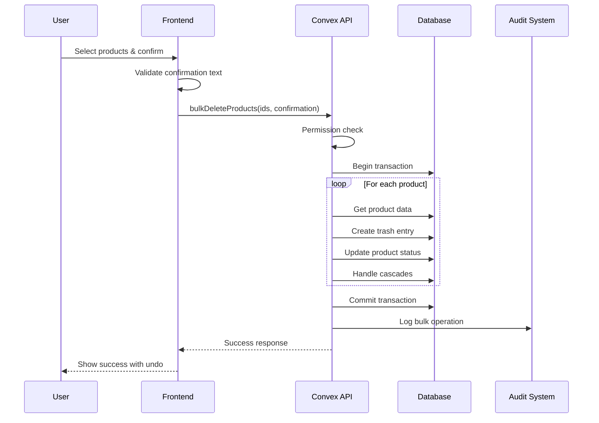
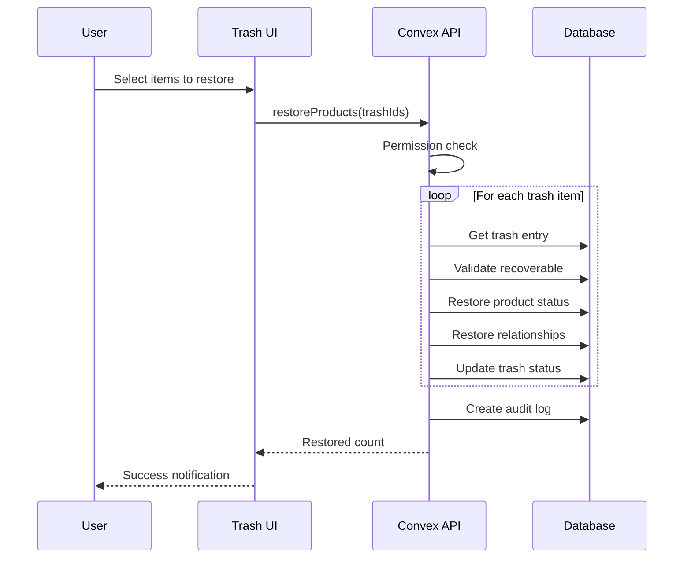

# Product Deletion Feature - Technical Architecture

## Executive Summary

This document outlines the technical architecture for a comprehensive product deletion system with soft delete functionality, 30-day recovery period, bulk operations, and robust audit logging. The system leverages existing soft delete patterns while adding trash management, cascade handling, and permanent deletion after retention period.

## 1. System Architecture

### High-Level Architecture

```
┌─────────────────────────────────────────────────────────────────┐
│                        Frontend Layer                            │
│  ┌────────────────┐  ┌─────────────────┐  ┌─────────────────┐ │
│  │ Manage Products │  │ Trash Management│  │ Activity Logs   │ │
│  │    Component    │  │    Component    │  │   Component     │ │
│  └────────┬───────┘  └────────┬────────┘  └────────┬────────┘ │
└───────────┼───────────────────┼─────────────────────┼──────────┘
            │                   │                     │
            ▼                   ▼                     ▼
┌─────────────────────────────────────────────────────────────────┐
│                      Convex Backend Layer                        │
│  ┌─────────────────┐  ┌─────────────────┐  ┌─────────────────┐│
│  │ Product Delete  │  │ Trash Management │  │  Audit Logging  ││
│  │   Mutations     │  │    Queries       │  │    System       ││
│  └────────┬────────┘  └────────┬────────┘  └────────┬────────┘│
└───────────┼────────────────────┼─────────────────────┼─────────┘
            │                    │                     │
            ▼                    ▼                     ▼
┌─────────────────────────────────────────────────────────────────┐
│                       Data Storage Layer                         │
│  ┌─────────────┐  ┌──────────────┐  ┌─────────────┐  ┌──────┐ │
│  │  Products    │  │ProductTrash  │  │  AuditLogs  │  │Cron  │ │
│  │  (status)    │  │   (new)      │  │  (enhanced) │  │Jobs  │ │
│  └─────────────┘  └──────────────┘  └─────────────┘  └──────┘ │
└──────────────────────────────────────────────────────────────────┘
```

### Component Interaction Flow

```
User Action → Permission Check → Validation → Soft Delete → Trash Entry → Audit Log
                                                ↓
                                    Cascade to Related Entities
                                                ↓
                                    Schedule Permanent Deletion
```

## 2. Data Model Specifications

### Enhanced Schema Design

```typescript
// New table for trash management
productTrash: defineTable({
  organizationId: v.id('organizations'),
  projectId: v.id('projects'),
  
  // Original product data
  productId: v.id('products'),
  productData: v.any(), // Full snapshot at deletion time
  
  // Deletion metadata
  deletedAt: v.number(),
  deletedBy: v.id('users'),
  deletionReason: v.optional(v.string()),
  deletionType: v.union(
    v.literal('manual'),
    v.literal('bulk'),
    v.literal('cascade'),
    v.literal('cleanup')
  ),
  
  // Recovery period
  expiresAt: v.number(), // deletedAt + 30 days
  permanentlyDeletedAt: v.optional(v.number()),
  
  // Bulk operation tracking
  bulkOperationId: v.optional(v.string()),
  
  // Related data tracking
  relatedData: v.object({
    variantIds: v.array(v.id('productVariants')),
    categoryAssignmentIds: v.array(v.id('categoryProductAssignments')),
    aiJobIds: v.array(v.id('aiCategorizationJobs')),
    imageStorageIds: v.array(v.string()),
  }),
  
  // Recovery status
  recoveryStatus: v.union(
    v.literal('recoverable'),
    v.literal('recovering'),
    v.literal('recovered'),
    v.literal('expired'),
    v.literal('permanently_deleted')
  ),
  recoveredAt: v.optional(v.number()),
  recoveredBy: v.optional(v.id('users')),
})
  .index('by_organization', ['organizationId'])
  .index('by_expiration', ['expiresAt', 'recoveryStatus'])
  .index('by_product', ['productId'])
  .index('by_bulk_operation', ['bulkOperationId'])

// Enhanced audit log for deletion tracking
deletionAuditLogs: defineTable({
  organizationId: v.id('organizations'),
  projectId: v.id('projects'),
  
  // Operation details
  operationType: v.union(
    v.literal('soft_delete'),
    v.literal('bulk_delete'),
    v.literal('restore'),
    v.literal('permanent_delete'),
    v.literal('auto_cleanup')
  ),
  
  // Affected entities
  affectedProducts: v.array(v.object({
    productId: v.id('products'),
    title: v.string(),
    sku: v.optional(v.string()),
    categories: v.array(v.string()),
  })),
  
  // Operation metadata
  totalCount: v.number(),
  breakdown: v.object({
    uncategorized: v.number(),
    categorized: v.number(),
    byCategory: v.array(v.object({
      categoryId: v.id('categories'),
      categoryName: v.string(),
      count: v.number(),
    })),
  }),
  
  // User and timestamp
  performedBy: v.id('users'),
  performedAt: v.number(),
  userEmail: v.string(),
  userName: v.string(),
  
  // Additional context
  ipAddress: v.optional(v.string()),
  userAgent: v.optional(v.string()),
  confirmationMethod: v.optional(v.string()), // e.g., "typed DELETE 45"
})
  .index('by_organization', ['organizationId'])
  .index('by_user', ['performedBy'])
  .index('by_timestamp', ['performedAt'])
```

### Data Relationships

```typescript
interface DataRelationships {
  // Product → Related Entities
  product_variants: "1:N cascade delete",
  category_assignments: "N:M remove associations",
  ai_categorization_jobs: "N:M preserve for history",
  import_jobs: "N:M preserve references",
  file_storage: "1:N mark for cleanup",
  
  // Trash → Recovery
  product_trash: "1:1 with original product",
  audit_logs: "1:N track all operations",
}
```

## 3. API Contracts

### Deletion Operations

```typescript
// Single product soft delete
export const deleteProduct = mutation({
  args: {
    productId: v.id('products'),
    reason: v.optional(v.string()),
  },
  handler: async (ctx, args) => {
    // 1. Permission check
    const { user, membership } = await authenticateAndAuthorize(ctx, ['owner', 'admin']);
    
    // 2. Get product with related data
    const product = await ctx.db.get(args.productId);
    if (!product) throw new Error('Product not found');
    
    // 3. Create trash entry
    const trashEntry = await createTrashEntry(ctx, product, user, args.reason);
    
    // 4. Soft delete product
    await ctx.db.patch(args.productId, { 
      status: 'archived',
      archivedAt: Date.now(),
      archivedBy: user._id,
    });
    
    // 5. Handle cascades
    await handleCascadeDeletion(ctx, product);
    
    // 6. Create audit log
    await createDeletionAuditLog(ctx, 'soft_delete', [product], user);
    
    return { success: true, trashId: trashEntry };
  },
});

// Bulk delete operation
export const bulkDeleteProducts = mutation({
  args: {
    productIds: v.array(v.id('products')),
    confirmationText: v.string(), // e.g., "DELETE 45"
    reason: v.optional(v.string()),
  },
  handler: async (ctx, args) => {
    // 1. Validate confirmation
    const expectedText = `DELETE ${args.productIds.length}`;
    if (args.confirmationText !== expectedText) {
      throw new Error('Invalid confirmation text');
    }
    
    // 2. Permission check
    const { user } = await authenticateAndAuthorize(ctx, ['owner', 'admin']);
    
    // 3. Batch process with transaction
    const bulkOperationId = generateId();
    const results = await ctx.db.transaction(async (tx) => {
      const processed = [];
      
      for (const productId of args.productIds) {
        const result = await processSingleDeletion(tx, productId, user, {
          bulkOperationId,
          reason: args.reason,
        });
        processed.push(result);
      }
      
      return processed;
    });
    
    // 4. Create consolidated audit log
    await createBulkDeletionAuditLog(ctx, results, user);
    
    return { 
      success: true, 
      deletedCount: results.filter(r => r.success).length,
      failedCount: results.filter(r => !r.success).length,
      bulkOperationId,
    };
  },
});

// Restore from trash
export const restoreProducts = mutation({
  args: {
    trashIds: v.array(v.id('productTrash')),
  },
  handler: async (ctx, args) => {
    const { user } = await authenticateAndAuthorize(ctx, ['owner', 'admin']);
    
    const results = await ctx.db.transaction(async (tx) => {
      const restored = [];
      
      for (const trashId of args.trashIds) {
        const trashEntry = await tx.get(trashId);
        if (!trashEntry || trashEntry.recoveryStatus !== 'recoverable') {
          continue;
        }
        
        // Restore product
        await tx.patch(trashEntry.productId, {
          status: 'active',
          archivedAt: undefined,
          archivedBy: undefined,
        });
        
        // Restore related data
        await restoreRelatedData(tx, trashEntry);
        
        // Update trash entry
        await tx.patch(trashId, {
          recoveryStatus: 'recovered',
          recoveredAt: Date.now(),
          recoveredBy: user._id,
        });
        
        restored.push(trashEntry.productId);
      }
      
      return restored;
    });
    
    // Audit log
    await createRestorationAuditLog(ctx, results, user);
    
    return { success: true, restoredCount: results.length };
  },
});

// Permanent deletion (admin only)
export const permanentlyDeleteProducts = mutation({
  args: {
    trashIds: v.array(v.id('productTrash')),
    confirmationText: v.string(), // "PERMANENTLY DELETE X"
  },
  handler: async (ctx, args) => {
    const { user } = await authenticateAndAuthorize(ctx, ['owner']);
    
    // Additional confirmation
    const expectedText = `PERMANENTLY DELETE ${args.trashIds.length}`;
    if (args.confirmationText !== expectedText) {
      throw new Error('Invalid confirmation');
    }
    
    // Process permanent deletion
    const results = await processPermanentDeletion(ctx, args.trashIds, user);
    
    return results;
  },
});
```

### Query Operations

```typescript
// Get trash items with pagination
export const getTrashItems = query({
  args: {
    organizationId: v.id('organizations'),
    projectId: v.optional(v.id('projects')),
    limit: v.optional(v.number()),
    cursor: v.optional(v.string()),
    sortBy: v.optional(v.union(
      v.literal('deletedAt'),
      v.literal('expiresAt'),
      v.literal('title')
    )),
  },
  handler: async (ctx, args) => {
    const { membership } = await authenticateAndAuthorize(ctx, ['viewer']);
    
    const query = ctx.db
      .query('productTrash')
      .withIndex('by_organization', q => 
        q.eq('organizationId', args.organizationId)
      )
      .filter(q => q.eq(q.field('recoveryStatus'), 'recoverable'));
    
    // Apply sorting
    const sorted = applySorting(query, args.sortBy);
    
    // Paginate
    const page = await sorted.paginate({
      cursor: args.cursor,
      numItems: args.limit || 50,
    });
    
    // Enrich with countdown
    const enriched = page.page.map(item => ({
      ...item,
      daysRemaining: calculateDaysRemaining(item.expiresAt),
      isExpiringSoon: item.expiresAt - Date.now() < 7 * 24 * 60 * 60 * 1000,
    }));
    
    return {
      items: enriched,
      continueCursor: page.continueCursor,
      isDone: page.isDone,
    };
  },
});

// Get deletion statistics
export const getDeletionStats = query({
  args: {
    organizationId: v.id('organizations'),
    timeRange: v.optional(v.union(
      v.literal('7d'),
      v.literal('30d'),
      v.literal('90d')
    )),
  },
  handler: async (ctx, args) => {
    const stats = await calculateDeletionStats(ctx, args);
    return stats;
  },
});
```

### Background Jobs

```typescript
// Cron job for permanent deletion after 30 days
export const cleanupExpiredTrash = internalMutation({
  handler: async (ctx) => {
    const expired = await ctx.db
      .query('productTrash')
      .withIndex('by_expiration')
      .filter(q => 
        q.and(
          q.lte(q.field('expiresAt'), Date.now()),
          q.eq(q.field('recoveryStatus'), 'recoverable')
        )
      )
      .collect();
    
    for (const item of expired) {
      // Permanent deletion
      await permanentlyDeleteProduct(ctx, item);
      
      // Update trash entry
      await ctx.db.patch(item._id, {
        recoveryStatus: 'permanently_deleted',
        permanentlyDeletedAt: Date.now(),
      });
    }
    
    // System audit log
    if (expired.length > 0) {
      await createSystemAuditLog(ctx, 'auto_cleanup', expired);
    }
    
    return { cleanedUp: expired.length };
  },
});

// Schedule the cron job (runs daily)
export const scheduleTrashCleanup = cronJob(
  'cleanup-expired-trash',
  { schedule: '0 0 * * *' }, // Daily at midnight
  cleanupExpiredTrash
);
```

## 4. Sequence Diagrams

### Bulk Delete Flow



### Recovery Flow



## 5. Technical Considerations

### Performance Requirements

```yaml
performance_targets:
  single_delete: < 200ms
  bulk_delete_100: < 2s
  bulk_delete_1000: < 10s
  trash_query_50: < 100ms
  restore_single: < 300ms
  restore_bulk_50: < 3s

optimization_strategies:
  - Batch database operations
  - Use transactions for consistency
  - Index on expiration dates
  - Paginate trash queries
  - Cache deletion stats
  - Background cleanup jobs
```

### Scalability Considerations

1. **Trash Table Growth**: Implement archival after permanent deletion
2. **Bulk Operations**: Process in chunks of 100 to avoid timeouts
3. **Audit Logs**: Partition by month, archive old logs
4. **File Cleanup**: Queue file deletions separately
5. **Real-time Updates**: Use Convex subscriptions efficiently

### Security Threat Model

```typescript
interface SecurityConsiderations {
  authorization: {
    delete_permission: ['owner', 'admin'],
    restore_permission: ['owner', 'admin'],
    view_trash_permission: ['owner', 'admin', 'editor'],
    permanent_delete_permission: ['owner'],
  },
  
  validation: {
    confirmation_text: 'Exact match required',
    bulk_limits: 'Max 1000 items per operation',
    rate_limiting: '10 operations per minute',
  },
  
  audit_trail: {
    all_operations: 'Logged with full context',
    ip_tracking: 'For security analysis',
    immutable_logs: 'Cannot be modified',
  },
  
  data_protection: {
    trash_isolation: 'Separate from active data',
    encryption: 'At rest and in transit',
    backup_retention: 'Include trash in backups',
  },
}
```

## 6. Edge Cases & Failure Modes

### Edge Cases

1. **Circular Dependencies**
   - Products referencing each other
   - Solution: Process in dependency order

2. **Large Bulk Operations**
   - 10,000+ products selected
   - Solution: Queue processing, progress updates

3. **Concurrent Modifications**
   - Product edited while being deleted
   - Solution: Optimistic locking, version checks

4. **Storage Quota**
   - Trash storage exceeding limits
   - Solution: Force cleanup of oldest items

5. **Related Entity Conflicts**
   - Category deleted while product in trash
   - Solution: Maintain referential integrity

### Failure Modes

```typescript
interface FailureHandling {
  network_timeout: {
    detection: 'Client-side timeout after 30s',
    recovery: 'Retry with exponential backoff',
    user_feedback: 'Show retry option',
  },
  
  partial_bulk_failure: {
    detection: 'Some items fail validation',
    recovery: 'Process valid items, report failures',
    user_feedback: 'Show success/failure breakdown',
  },
  
  transaction_rollback: {
    detection: 'Database constraint violation',
    recovery: 'Full rollback, no partial state',
    user_feedback: 'Clear error message',
  },
  
  restoration_conflict: {
    detection: 'SKU already exists',
    recovery: 'Generate new SKU on restore',
    user_feedback: 'Notify of changes made',
  },
}
```

## 7. Implementation Tasks

### Phase 1: Core Infrastructure (Backend)
```yaml
tasks:
  - id: B1
    description: "Create productTrash table schema"
    effort: "2 hours"
    dependencies: []
    assigned_to: backend-agent
    
  - id: B2
    description: "Implement soft delete mutations"
    effort: "4 hours"
    dependencies: [B1]
    assigned_to: backend-agent
    
  - id: B3
    description: "Implement cascade deletion logic"
    effort: "3 hours"
    dependencies: [B1]
    assigned_to: backend-agent
    
  - id: B4
    description: "Create trash query operations"
    effort: "3 hours"
    dependencies: [B1]
    assigned_to: backend-agent
    
  - id: B5
    description: "Implement restore functionality"
    effort: "4 hours"
    dependencies: [B1, B2]
    assigned_to: backend-agent
    
  - id: B6
    description: "Set up cron job for cleanup"
    effort: "2 hours"
    dependencies: [B1]
    assigned_to: backend-agent
    
  - id: B7
    description: "Enhanced audit logging"
    effort: "3 hours"
    dependencies: [B2, B3]
    assigned_to: backend-agent
```

### Phase 2: Frontend Implementation
```yaml
tasks:
  - id: F1
    description: "Create manage products page"
    effort: "4 hours"
    dependencies: []
    assigned_to: frontend-agent
    
  - id: F2
    description: "Implement multi-step deletion dialogs"
    effort: "6 hours"
    dependencies: [B2]
    assigned_to: frontend-agent
    
  - id: F3
    description: "Build trash management interface"
    effort: "5 hours"
    dependencies: [B4, B5]
    assigned_to: frontend-agent
    
  - id: F4
    description: "Add activity log visualization"
    effort: "4 hours"
    dependencies: [B7]
    assigned_to: frontend-agent
    
  - id: F5
    description: "Mobile responsive design"
    effort: "3 hours"
    dependencies: [F1, F2, F3]
    assigned_to: frontend-agent
```

### Phase 3: Testing & Quality
```yaml
tasks:
  - id: Q1
    description: "Unit tests for mutations"
    effort: "3 hours"
    dependencies: [B2, B3, B5]
    assigned_to: quality-agent
    
  - id: Q2
    description: "Integration tests for flows"
    effort: "4 hours"
    dependencies: [F2, F3]
    assigned_to: quality-agent
    
  - id: Q3
    description: "E2E tests with Playwright"
    effort: "4 hours"
    dependencies: [F1, F2, F3]
    assigned_to: quality-agent
    
  - id: Q4
    description: "Performance testing"
    effort: "2 hours"
    dependencies: [B2, B3]
    assigned_to: quality-agent
    
  - id: Q5
    description: "Security audit"
    effort: "2 hours"
    dependencies: [B2, B5, B6]
    assigned_to: quality-agent
```

### Phase 4: Documentation
```yaml
tasks:
  - id: D1
    description: "API documentation"
    effort: "2 hours"
    dependencies: [B2, B3, B4, B5]
    assigned_to: docs-agent
    
  - id: D2
    description: "User guide for deletion"
    effort: "2 hours"
    dependencies: [F1, F2, F3]
    assigned_to: docs-agent
    
  - id: D3
    description: "Admin guide for trash"
    effort: "1 hour"
    dependencies: [F3]
    assigned_to: docs-agent
```

## 8. Success Metrics

### Functional Requirements
- ✅ Products can be soft deleted individually or in bulk
- ✅ 30-day recovery period enforced
- ✅ Automatic permanent deletion after expiry
- ✅ Full audit trail maintained
- ✅ Related data properly cascaded
- ✅ Restore functionality works correctly

### Performance Metrics
- Response time < 200ms for single delete
- Bulk operations handle 1000+ items
- Trash queries return in < 100ms
- No data inconsistencies

### Security Requirements
- Role-based access enforced
- All operations audited
- Confirmation required for destructive actions
- No unauthorized data access

### Scalability Targets
- Support 100K+ products in trash
- Handle 10K+ deletions per day
- Maintain performance at scale
- Efficient storage usage